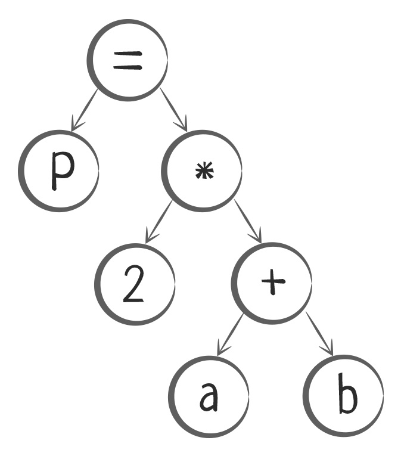
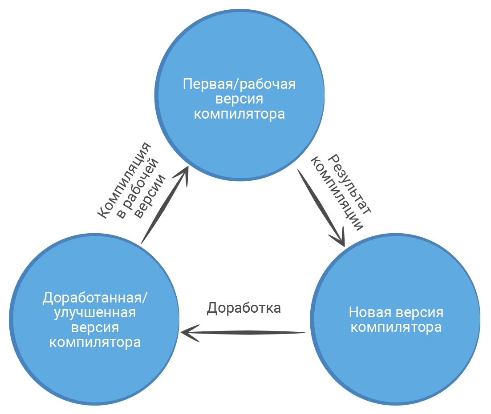

Процессор — обрабатывает информацию, выполняет команды пользователя и следит за работой всех подключенных устройств. процессор может разобрать только машинный код — набор 0 и 1, записаны в определённом порядке.

В процессор поступают электрические сигналы. Сильный сигнал 1, а слабый — 0. Набор таких цифр обозначает какую-то команду. Процессор ее распознает и выполняет.

Программы для первых компьютеров выглядели как огромные наборы 0 и 1.

чтобы процессор понимал, какие команды записаны в программе, программисты создали компилятор — программу, которая преобразует программный код в машинный.

Преобразование программного кода в машинный= компиляцией. Компиляция только преобразует код. не запускает его на исполнение. он "статически" (без запуска) транслируется в машинный код. текст программы разбирается на части и анализируется, а затем генерируется код, понятный процессору.

Разбор -> Анализ -> Генерация

этапы компиляции на примере вычисления периметра прямоугольника:

#include <iostream>

int main()
{
    double a=2.5, b=5, P;
    P = 2 * (a + b);
    printf("Width of the rectangle - %4.1f", a);// => Width of the rectangle - 2.5
    printf("\nLength of the rectangle - %4.1f", b);// => Length of the rectangle - 5.0
    printf("\nPerimeter of the rectangle is %4.1f", P);// => Perimeter of the rectangle is 15.0
    return 0;
}

После запуска программы компилятору определить, какие команды в ней записаны. компилятор разделяет программу на слова и знаки — токены, и записывает их в список. процесс - лексическим анализом. задача — получить токены.

Затем компилятор читает список и ищет токен-операторы. оператор присваивания(=), арифметические операторы(+,-,*,/), оператор вывода(printf()) и другие. операторы работают с числами, текстом и переменными.

Компилятор понять, какие токены в списке связаны с токен-оператором. для каждого оператора строится специальная структура — логическое дерево или дерево разбора.

операция P = 2*(a + b) будет преобразована в логическое дерево:

каждое дерево нужно разобрать на команды, и каждую команду преобразовать в машинный код. Компилятор читать дерево снизу вверх и составляет список команд:

Взять переменную a, взять переменную b, сложить их
Взять результат сложения, взять число 2 и найти их произведение
Результат произведения присвоить (записать) в переменную P
Компилятор еще раз проверяет команды, находит ошибки и старается улучшить код. При завершении этого этапа, компилятор переводит каждую команду в набор 0 и 1. Наборы записываются в файл, который сможет прочитать и выполнить процессор.

10111011 00010001 00000001 10111001 00001101 00000000 10110100 00001110 10001010 00000111

программу с набором исполняемых команд, которая могла компилировать другие программы на Fortran, и улучшенную версию себя.

Ни один компилируемый язык программирования не обходится без компилятора. компиляторы работают с несколькими языками программирования.

процессоры отличаются друг от друга устройством, поэтому машинный код для одного процессора будет понятен, а для другого нет. операционных систем: одна и та же программа будет работать на Windows, но не запустится на Linux или MacOS.пользоваться тем компилятором, который работает с нужным процессором и операционной системой.

Если программа будет работать на нескольких операционных системах, кросс-компилятор — преобразует универсальный машинный код. Например, GNU Compiler Collection(сокращенно GCC) поддерживает C++, Objective-C, Java, Фортран, Ada, Go и поддерживает разную архитектуру процессоров.

Когда компилятор анализирует текст программы, он проверяет, соответствует ли запись оператора стандартам языка. Если найдено несоответствие, то компилятор выводит об этом информацию пользователю в виде ошибки. Когда вся программа разобрана, пользователь видит список ошибок, которые есть в коде, и может их исправить. Пока программист не исправит ошибки, компилятор не перейдет к следующему этапу — генерации машинного кода для процессора. Чаще всего компилятор показывает пользователю:

ошибки объявления переменных или отсутствие их начальных значений
ошибки несоответствия типов
ошибки неправильной записи операторов и функций
Иногда компилятор определяет код, который при выполнении дает неправильный результат. Но преобразовать такую программу в машинный код все-таки можно. компилятор показывает пользователю предупреждение.

Компилятор — переводчик между программистом и процессором. преобразует текст программы в машинный код, определяет ряд ошибок в программе и оптимизирует ее работу.

Компилятор это программа, которая выполняет преобразование текста программы в другое представление, обычно машинный код, без его запуска, статически. Затем эта программа уже может быть запущена на выполнение. Интерпретатор сразу запускает код и выполняет его в процессе чтения. Промежуточного этапа как в компиляции нет.

преимущество Java над другими языками — это мультиплатформенность. Что же это такое и с чем его едят? Начнем издалека.

Дело в том, что компьютер умеет исполнять только простейшие команды.

Для собак есть команды «Рядом», «Лапу» и другие, слыша которую собака делает что-то важное. У компьютера роль таких команд выполняют числа: каждая команда закодирована некоторым числом (его еще называют машинным кодом).

Писать программу в виде чисел очень сложно, поэтому люди придумали языки программирования и компиляторы. Такой язык, с одной стороны, понятен человеку, с другой — компилятору. Компилятор — это специальная программа, которая переводит текст программы, написанный на языке программирования, в набор машинных кодов.

Обычно программист пишет программу на языке программирования, а затем запускает компилятор, который на основе написанных программистом файлов с кодом программы делает один файл с машинным кодом — окончательную (скомпилированную) программу.

Программа на языке C++ -> Компилятор -> Программа, состоящая из машинных кодов
Этапы компиляции для языка C++

Получившаяся в итоге программа сразу может выполняться на компьютере. Минус такого подхода в том, что код полученной программы сильно зависит от процессора и операционной системы. Программа, скомпилированная под Windows, не будет работать на телефоне с Android.

Если вы написали программу под Android, то на операционной системе Windows она не запустится!

Но у Java гораздо более инновационный подход.

Программа на языке Java -> Java‑компилятор -> Программа, состоящая из специальных кодов (байт‑код) -> Java VM -> Программа, состоящая из машинных кодов
Этапы компиляции для языка Java

Компилятор Java не компилирует все классы в одну программу из машинных кодов. Вместо этого он компилирует каждый класс по отдельности, и не в машинные коды, а в специальный промежуточный код (байт-код). Компиляция в машинный код выполняется при запуске программы.

А кто же компилирует программу в машинный код при ее запуске?

Для этого есть специальная программа под названием JVM (Java Virtual Machine) — Виртуальная Машина Java. Сначала запускают ее, а затем — программу, состоящую из байт-кода. А уже JVM перед выполнением нужной программы компилирует ее в машинный код.

Если у вас крутой процессор, который поддерживает больший набор машинных команд, то во время "второй компиляции" сгенерируется машинный код с учетом именно вашего процессора и ОС. Именно поэтому Java иногда быстрее С++, который сразу компилируется в машинный код и может использовать только самые распространение команды процессора.

2. Типовые ошибки при компиляции
Скорость и оптимизация кода нам пока что не сильно важна, а вот что важно, так это то, что компилятор проверяет вашу программу на ошибки. Он проверяет код на корректность и не пустит его дальше, если нашёл даже маленькую ошибку.

Пример ошибки:
Вы пытаетесь присвоить число переменной, которая может хранить только текст.

String userName = 42; // Ой! Нельзя так.
Компилятор сразу выдаст ошибку, что типы не соответствуют: Cannot implicitly convert type 'int' to 'string'.

Другой пример — опечатка в команде println:

System.out.printline("Привет!"); // Ошибка в названии метода
Компилятор скажет: "Нет такого метода — проверяй синтаксис!"
