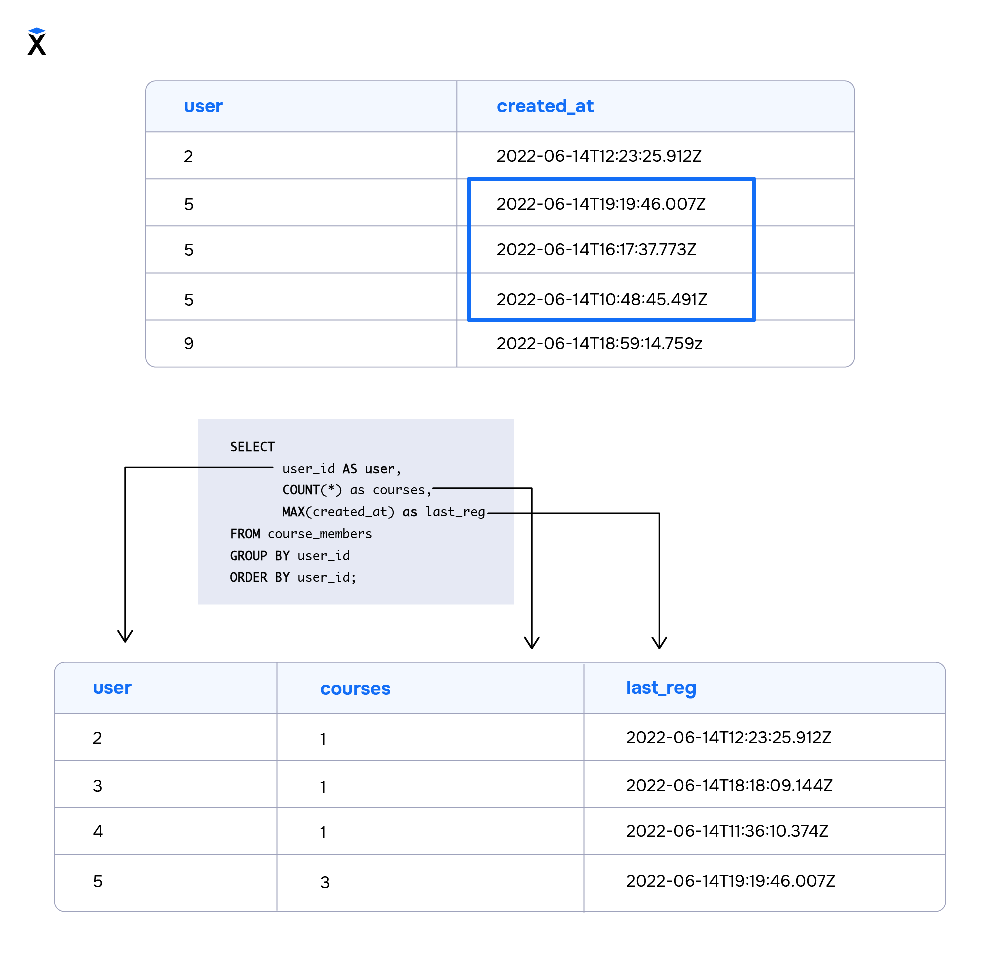
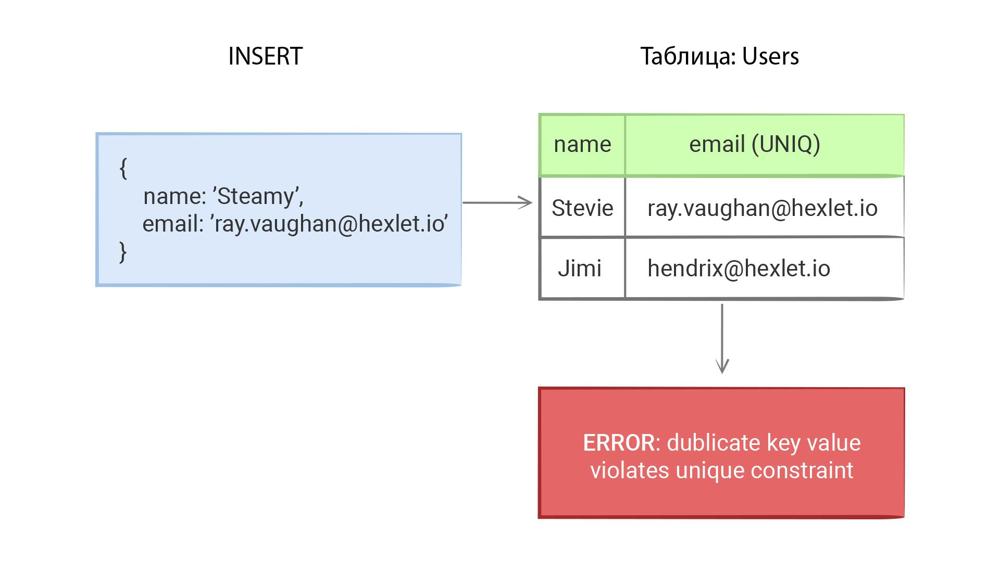
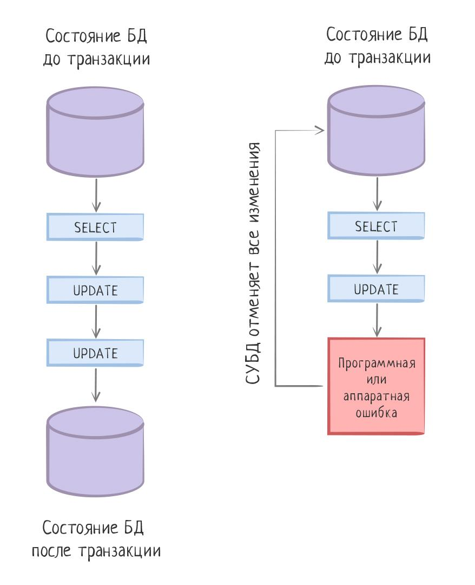

В реляционных БД таблицы представляют отношения, где строки - экземпляры данных, а столбцы — свойства (атрибуты) этих данных.

SQL — декларативный ЯП. описывает, что нужно получить, не объясняя, как именно нужно прийти к такому результату.

varchar(10) -- для строк с ограничением макс длины
text -- для строк без ограничения.

нельзя оставить первый тип без указания длины. Данные в базах данных физически хранятся на дисках в файлах. Быстрый доступ к этим данным возможен только тогда, когда у данных фикс размер. быстро перемещаться по ним и считать смещения.

Если размер данных не известен, просматривать весь файл в поисках нужного значения. text хранится отдельно. негативно влияет на скорость, но не так сильно. Если размер строки известен или он меньше какого-то значения varchar.

integer выбор для целых чисел	-2147483648 .. +2147483647
bigint	целое в большом диапазоне	-9223372036854775808 .. 9223372036854775807
real	вещественное число с переменной точностью	-2147483648 .. +2147483647, точность в пределах 6 десятичных цифр

даты как и строки заключаются в одинарные кавычки
хранить день без времени? date.
момент времени, timestamp.
время без даты? time.

timestamp	дата и время (без часового пояса)	4713 до н. э.	294276 н. э.	1 микросекунда
date	дата (без времени суток)	4713 до н. э.	5874897 н. э.	1 день
time	время суток (без даты)	00:00:00	24:00:00	1 микросекунда

добавление и заполнение полей created_at и updated_at в каждую таблицу.

1999-01-08	ISO 8601 (рекомендуемый формат)

Помимо типов данных для реальных значений, в базе сущ специальное значение NULL, обозначать пустоту. у поля нет значения. Тип поля не важен.

Первичный ключ (уникально идентифицирует каждую запись в таблице) в таблице может быть только один, и для него используется отдельное поле -- идентификатор
Использование первичных ключей в SQL помогает обеспечить целостность данных в базе.

Для сравнения и проверки на NULL операторы IS и IS NOT.

проверка значения NULL с =, >, < результат NULL.

SELECT * FROM users WHERE birthday IS NOT NULL;

В отличие от строки нулевой длины, NULL говорит, что никакое значение не занесено в текущую ячейку БД.

фильтрации строки по шаблону - подстроке, найти. оператор LIKE (NOT LIKE), после которого шаблон. найти людей, чьи фамилии начинаются на "Sch":
SELECT id, first_name, last_name, email, birthday FROM users WHERE last_name LIKE 'Sch%';

ILIKE ищет строки без учета регистра

Для работы с регулярными выражениями оператор SIMILAR TO вместо LIKE.

выбрать пользователей, чье имя начинается на 'A' или 'B'.
WHERE first_name SIMILAR TO '[AB]%';

В квадратных скобках перечисляются допустимые символы, а далее следует знакомый нам символ %. Этот запрос вернет пользователей с именами Abigale, Andy, Brayan

найти пользователей, у которых username заканчивается любой буквой. Это можно сделать таким шаблоном: %[abcdefghijklmnopqrstuvwxyz]. запись неудобна для чтения и записи. случайно пропустим какую-то букву? В квадратных скобках можно использовать символ - для перечисления. Если записать в квадратных скобках начальный символ, поставить "-" и указать конечный символ, то такой шаблон вернет любой символ из диапазона от начального до конечного. Напишем запрос, который вернет всех пользователей по условию: username заканчивается любой буквой.

WHERE username SIMILAR TO '%[a-z]';

также работает и с рус. буквами и цифрами.

в поле email введены корректные адреса электронной почты.

Корректная почта должна содержать адрес, который состоит из:

Имени с любым количеством любых символов — my_email
Символа @
Домена с любым количеством любых символов — gmail
Точки
Указания национальной зоны — например, com
Запрос на поиск корректных адресов:

WHERE email SIMILAR TO '%@%.%';

выведет имена пользователей с корректными адресами электронной почты, однако нам интереснее найти ошибки. В этом случае частица NOT позволит найти строки, которые не соответствуют шаблону:

SELECT
    username,
    email
FROM users WHERE email NOT SIMILAR TO '%@%.%';

адреса электронной почты, у которых национальная зона состоит ровно из двух символов — например, ru, su, io и так далее. При этом исключим зоны, состоящие из трех и более символов — например, com.

Это можно сделать так: %.[a-z][a-z]. Но удобнее воспользоваться еще одним спецсимволом — подчеркиванием _.

Символ подчеркивания обозначает ровно один любой символ, необязательно букву. Наш запрос будет выглядеть так:

SELECT
    username,
    email
FROM users WHERE email SIMILAR TO '%@%.__';

пользователей с адресами электронной почты оканчивающимися на 3 символа, нужно добавить еще одно подчеркивание в наш шаблон:

SELECT
    username,
    email
FROM users WHERE email SIMILAR TO '%.___';

Мы рассмотрели наиболее полезные и часто используемые возможности регулярных выражений в SQL, но они ими не ограничиваются. Полный перечень возможностей вы можете посмотреть в документации.

Выводы
В этом уроке мы познакомились с оператором SIMILAR TO. Он помогает формировать шаблоны для фильтрации текстовых полей. Повторим самые полезные и часто используемые спецсимволы:

Символ % соответствует любому количеству любых символов
Квадратные скобки [] используются для перечисления конкретных символов — например, [АЕИОУЭЮ]
Дефис - в квадратных скобках означает перечисление символов — например, [0-9] соответствует любой цифре
Подчеркивание _ означает ровно один любой символ (букву или цифру)

Операторы ~ и SIMILAR TO в PostgreSQL используются для выполнения операций поиска по регулярным выражениям, но есть несколько ключевых различий между ними.

Оператор ~ используется для поиска строк, соответствующих определенному регулярному выражению. Этот оператор не входит в стандарт языка SQL и является специфичным для PostgreSQL. Он более гибкий и мощный, чем SIMILAR TO, так как поддерживает более широкий набор функциональных возможностей регулярных выражений.

Примеры использования оператора ~:

-- Найти все имена, начинающиеся с буквы "A"
SELECT * FROM users WHERE name ~ '^A';

-- Найти имена, содержащие две буквы "o" подряд
SELECT * FROM users WHERE name ~ 'o{2}';

-- Найти имена, начинающиеся с буквы "a" или "A", игнорируя регистр
SELECT * FROM users WHERE name ~* '^a';

-- Найти все имена, начинающиеся с букв от "A" до "F"
SELECT * FROM users WHERE name ~ '^[A-F]';
Оператор SIMILAR TO используется для поиска строк, соответствующих шаблону, который напоминает регулярное выражение, но с более ограниченным набором функций. Он обычно используется для простых сценариев сопоставления шаблонов.

Пример использования оператора SIMILAR TO:

-- Найти все имена, начинающиеся с буквы "A"
SELECT * FROM users WHERE name SIMILAR TO 'A%';

-- Найти имена, содержащие две буквы "o" подряд
SELECT * FROM users WHERE name SIMILAR TO '%o{2}%';

-- Найти имена, начинающиеся с буквы "a" или "A", игнорируя регистр
SELECT * FROM users WHERE name SIMILAR TO '(a|A)%';

-- Найти все имена, начинающиеся с букв от "A" до "F"
SELECT * FROM users WHERE name SIMILAR TO '[A-F]%';

-- Найти строки, содержащие слово "John"
SELECT * FROM users WHERE name SIMILAR TO '%\\yJohn\\y%';

\y часто используется в некоторых реализациях регулярных выражений как граница слова, аналогично \b в стандартных регулярках.

приоритет оператора AND выше, чем OR.

Рассматривай NOT как ! отрицание

строки, в которых поле соответствует значению из набора. пользователей с идентификаторами 1, 2 или 5.
WHERE id IN (1, 2, 5);
WHERE first_name IN ('Lionel', 'Lucienne', 'Jennyfer');

отсортировать по нескольким полям.
ORDER BY first_name ASC, created_at DESC;
сначала выполняется сортировка по имени. Затем внутри групп с одинаковым именем данные сортируются по created_at.

сортировать данные с NULL. в MySQL NULL впереди при сортировке по возрастанию, в PostgreSQL в конце.
если данные содержат NULL, важно явно указывать, где располагаться значения NULL в результирующем наборе.
ORDER BY created_at ASC NULLS FIRST;
ORDER BY created_at DESC NULLS LAST;

Таблицы в веб-проектах содержат огромное количество данных, поэтому их никогда не показывают на страницах сразу все. Обычно выводится лишь небольшая часть — например, 10 строк.

Чтобы ограничить выборку, используется LIMIT. В этом уроке разберем, как работать с таким запросом.

Как ограничивать выборку таблицы
Представим, что нам нужно извлечь 10 записей. Для этого выполним такой запрос:

SELECT
    id,
    username,
    email
FROM users LIMIT 10;

какой порядок сортировки был по умолчанию. Поэтому мы не можем заранее узнать, какие 10 записей мы получим. Чтобы это выяснить, нужно определить сортировку.

Оператор LIMIT без сортировки практически никогда не используется. Поэтому нужно задать сортировку таким образом:

SELECT
    id,
    username,
    email
FROM users ORDER BY id LIMIT 10;

пользователь хочет посмотреть следующие 10 записей. Это реализуется через пагинацию — механизм, который позволяет перемещаться по страницам.

Чтобы реализовать пагинацию, одного LIMIT недостаточно. Еще понадобится смещение OFFSET:

SELECT
    id,
    username,
    email
FROM users ORDER BY id LIMIT 10 OFFSET 10;

Этот запрос:

Отсортирует все записи.
Пропустит первые 10 записей за счет части OFFSET 10.
Возьмет следующие 10 записей.
Если менять OFFSET, можно обойти все данные в таблице:

-- Выбрать записи с 21 по 30
SELECT
    id,
    username,
    email
FROM users ORDER BY id LIMIT 10 OFFSET 20;

-- Выбрать записи с 31 по 40
SELECT
    id,
    username,
    email
FROM users ORDER BY id LIMIT 10 OFFSET 30;

не забывать о сортировке данных - без нее оператор LIMIT на практике не используется. А чтобы выбрать записи не с начала таблицы, нужно воспользоваться смещением OFFSET.

на какие курсы онлайн-школы записались студенты. Для этого нам нужно выполнить запрос на выборку из таблицы course_members:

SELECT course_id FROM course_members ORDER BY course_id;

выбрали идентификаторы всех курсов, на которые записался хотя бы один студент. Видно, что некоторые идентификаторы курсов повторяются — на них записалось по несколько студентов.

Сейчас мы изучаем только сами курсы, не обращая внимания на количество записавшихся студентов. Поэтому нам нужно убрать повторяющиеся идентификаторы и оставить только уникальные.

В этом уроке мы разберемся, как это сделать.

Как убрать повторяющиеся строки
В языке SQL существует специальный оператор DISTINCT, который удаляет повторяющиеся строки запроса и оставляет только уникальные. Запрос будет выглядеть так:

SELECT DISTINCT course_id FROM course_members ORDER BY course_id;

из этого запроса исключены все повторяющиеся строки.

Таким образом, чтобы исключить повторяющиеся строки, нужно после оператора SELECT указать DISTINCT и перечислить все нужные столбцы.

Если мы добавим в наш запрос еще одно поле user_id, то это изменит результат запроса. В эту выборку попадут строки с уникальным сочетанием курса и слушателя.

По отдельности курсы и слушатели могут повторяться, но их сочетание будет уникальным:

-- DISTINCT добавляется в запрос только один раз,
-- независимо от того, сколько колонок перечисляется
SELECT DISTINCT
    course_id,
    user_id
FROM course_members ORDER BY course_id;

выбрать уникальные курсы и добавить дату, когда на него записался первый студент.

Напишем запрос, в котором после DISTINCT укажем course_id и created_at. Он вернет нам уникальные сочетания этих двух полей:

SELECT DISTINCT course_id, created_at FROM course_members ORDER BY course_id;

Есть модификация этого оператора — DISTINCT ON. Такой вариант оператора позволяет указать:

Поле, которое должно быть уникальным.
Поля, которые нужно вывести.
Так выглядит запрос с DISTINCT ON:

SELECT DISTINCT ON (course_id)
    course_id,
    created_at
FROM course_members
ORDER BY course_id, created_at;

После DISTINCT ON в круглых скобках мы указываем поле, по которому будет проверяться уникальность. Далее мы перечисляем те поля, которые мы хотим видеть в запросе.

В нашем запросе идентификаторы курсов не повторяются, а в качестве created_at выводится первая дата выбора курса.

В DISTINCT ON можно указывать несколько полей в качестве уникальных:

SELECT DISTINCT ON (course_id, created_at)
    course_id,
    created_at
FROM course_members
ORDER BY course_id;

Такой запрос будет равносилен первому запросу этого раздела:

SELECT DISTINCT
    course_id,
    created_at
FROM course_members ORDER BY course_id;
Сортировка с оператором DISTINCT ON
При работе с DISTINCT ON важно правильно использовать сортировку. Первыми полями в ORDER BY должны быть те, которые идут после DISTINCT ON.

Для примера напишем еще один запрос — к каждому уникальному курсу выведем дату, в которую записался последний студент.

Для этого нужно после ORDER BY сначала указать поле course_id, как того требует синтаксис. Затем нужно добавить поле created_at с сортировкой по убыванию:

SELECT DISTINCT ON (course_id)
    course_id,
    created_at
FROM course_members
ORDER BY course_id, created_at DESC;

Этот запрос выведет все уникальные курсы и дату, когда на этот курс в последний раз записывались.

оператор DISTINCT и научились с помощью него выбирать уникальные строки и удалять дублирующиеся. Кроме того, мы разобрались с модификацией DISTINCT ON, научились задавать уникальные поля и добавлять к ним дополнительную информацию.

Язык SQL — не просто язык запросов, а мощный инструмент, похожий на язык программирования, хотя и очень специфичный. Как и в других языках, здесь есть функции, незаменимые в конкретных задачах: найти сумму или среднее по столбцу, минимум или максимум. Такие функции называются агрегатными.

Чтобы вызвать агрегатную функцию, нужно написать ее имя и затем в круглых скобках передать аргументы — переменные, над которыми будут совершаться действия. В этом уроке мы поближе познакомимся с агрегатными функциями и их аргументами.

Функция COUNT
Ранее в курсе мы научились выбирать все записи из таблицы. Например, мы можем выбрать все записи из таблицы пользователей с помощью такого запроса:

SELECT * FROM users;

Запрос вернет нам много строк, но точное их количество мы не знаем. Чтобы это выяснить, можно использовать функцию COUNT — она возвращает количество записей в выборке.

Ответить на вопрос «А сколько записей содержится в таблице users?» можно с помощью такого запроса:

SELECT COUNT(*) FROM users;

Этот запрос выведет нам ровно одно число — количество строк в запросе. Это равносильно количеству пользователей в нашей базе, потому что в этой таблице хранится информация об уникальных пользователях.

В качестве аргумента мы передали символ *, который заменяет все поля таблицы.

Еще в качестве аргумента мы можем передать имя поля. В этом случае функция вернет нам количество строк, в которых поле НЕ равно NULL. Выполним такой запрос:

SELECT COUNT(id) FROM users;

Этот запрос также вернул значение 99 — это количество строк, id которых не равен NULL.

Подадим в качестве аргумента поле email_confirmed:

SELECT COUNT(email_confirmed) FROM users;

Этот запрос вернул 0, потому что в таблице поле email_confirmed не содержит никаких данных.

Обратите внимание, что COUNT возвращает количество записей в запросе, а не в таблице:

SELECT COUNT(*) FROM users WHERE gender = 'female';

Этот запрос вернет количество девушек среди всех пользователей.

Функция SUM
Функция SUM возвращает сумму всех значений:

SELECT SUM(spent_minutes) FROM course_reviews;

В этом запросе мы нашли суммарное время, проведенное всеми пользователями на онлайн-курсах.

В качестве аргумента в функцию SUM нужно передать числовое поле. Если передать поле, в котором хранятся строки или даты, то запрос вернет ошибку. Также, не получится передать в функцию символ *, как мы это делали с функцией COUNT:

-- Передадим поле с датами создания — запрос вернет ошибку
SELECT SUM(created_at) FROM course_reviews;

-- Передадим символ '*' — запрос завершится с ошибкой
SELECT SUM(*) FROM course_reviews;
Query Error: error: function sum(timestamp without time zone) does not exist
Query Error: error: function sum() does not exist

Функция AVG
Чтобы найти среднее арифметическое всех значений, нужно воспользоваться функцией AVG (average — среднее).

Работает функция так же как и SUM. В качестве аргумента нужно передать числовое поле.

Найдем среднее время, проведенное пользователем с id = 9 на площадке онлайн-школы:

SELECT AVG(spent_minutes) FROM course_reviews WHERE user_id = 9;

Функции MAX и MIN позволяют найти максимальное и минимальное значение соответственно. Найдем максимальное время прохождения курса:

SELECT MAX(spent_minutes) FROM course_reviews;
SELECT MIN(spent_minutes) FROM course_reviews;

В качестве аргументов в функции MAX и MIN можно передавать поля числовых типов, а так же даты и строки. Для строк минимальное и максимальное значения — это первая и последняя строки, упорядоченные по алфавиту:

SELECT MIN(username) FROM users;

Запрос с функцией MIN выведет пользователя Abelardo58, потому что он идет первым по алфавиту.

Рассмотрим еще один пример:

SELECT MAX(username) FROM users;

Запрос с функцией MAX выведет пользователя Zoey24, потому что он идет по алфавиту последним.

COUNT - позволяет подсчитать количество строк
SUM - позволяет найти сумму чисел
AVG - позволяет подсчитать среднее арифметическое
MAX - возвращает максимальное значение численного поля или последнюю строку по алфавиту
MIN - возвращает минимальное значение численного поля или первую строку по алфавиту

Агрегатные функции часто используются в запросах. Например, мы можем подсчитать количество курсов, на которые записался каждый пользователь.

Сначала выберем уникальных пользователей в таблице course_members:

SELECT DISTINCT user_id
FROM course_members
ORDER BY user_id;

Затем для каждого пользователя подсчитаем количество курсов. Запросы будут выглядеть так:

SELECT COUNT(*) FROM course_members WHERE user_id = 2;
SELECT COUNT(*) FROM course_members WHERE user_id = 3;
-- И так далее для остальных пользователей

в нашей таблице слишком много пользователей. Писать отдельный запрос для каждого слишком долго, а еще есть вероятность кого-то пропустить.

Справиться с этой сложностью помогает группировка данных, которую мы изучим в этом уроке.

Оператор GROUP BY
Группировка данных позволяет объединить одинаковые значения в заданных полях в группы, а затем выполнять подсчеты для каждой группы.

Для группировки данных существует специальный оператор GROUP BY. Запрос с подсчетом курсов каждого пользователя будет выглядеть так:

SELECT
    user_id,
    COUNT(*)
FROM course_members
GROUP BY user_id
ORDER BY user_id;
Мы могли бы создавать по отдельному запросу для каждого пользователя, но вместо этого использовали конструкцию GROUP BY user_id. В ней мы указали, что нам нужно объединить строки с одинаковыми идентификаторами user_id, вывести идентификатор и количество строк в каждой группе COUNT(*).

Для удобства мы отсортировали данные по идентификатору, но это необязательно:

Система управления базами данных автоматически присвоила нашему второму столбцу имя count, совпадающее с именем функции. Но мы можем переименовать этот столбец, как и любой другой:

SELECT
    user_id AS student,
    COUNT(*) AS courses_count
FROM course_members
GROUP BY user_id
ORDER BY user_id;

Чтобы присвоить столбцу псевдоним, нужно после его определения записать AS и указать желаемое имя. Оно должно начинаться с буквы и не должно содержать пробелов.

Как работает GROUP BY
Теперь попытаемся выполнить следующий запрос:

SELECT
    user_id AS student,
    created_at,
    COUNT(user_id) AS courses_count
FROM course_members
GROUP BY user_id
ORDER BY user_id;
Запрос завершится с ошибкой:

Query Error: error: column "course_members.created_at" must appear in the GROUP BY clause
or be used in an aggregate function
Ошибка в том, что СУБД не понимает, что делать со столбцом created_at — либо он должен быть в конструкции GROUP BY, либо к нему надо применить агрегатную функцию.

Чтобы лучше понять работу GROUP BY, разберемся, почему запрос выше не работает.

Дело в том, что группировка обращается к записям в таблице. Она создает из них независимые группы записей, по которым проводится анализ.

При работе с группой мы можем выбрать один из двух вариантов:

Либо вывести поле, по которому проводим группировку. Его значение будет одинаковым для группы
Либо применить к полю какую-либо агрегатную функцию — например, COUNT(), MAX(), MIN() или AVG(). В этом случае СУБД будет знать, как обработать несколько разных значений.
Вернемся к примеру выше. В своем запросе мы не группируем данные по столбцу created_at — это не то, что нам нужно. Если бы мы это сделали, пришлось бы работать с группами, в которых совпадают идентификатор пользователя и дата создания.

Кроме того, мы не указали никакой агрегатной функции для этого столбца. СУБД не понимает, что именно нужно сделать с группой разных дат создания. Нужно посчитать среднее? Или взять максимальную дату?

Давайте исправим запрос. Выведем максимальное значение поля created_at для группы. Это будет дата последней регистрации пользователя на курс:

SELECT
    user_id AS student,
    COUNT(user_id) AS courses_count,
    MAX(created_at) AS last_reg
FROM course_members
GROUP BY user_id
ORDER BY user_id;

оператор GROUP BY. Теперь вы можете объединять одинаковые записи в группы и считать для этих групп агрегатные функции.

поля, которые вы будете выводить в запросе, нужно указывать в операторе GROUP BY или применять к ним агрегатную функцию.

отфильтровать записи после группировки.

вывести суммарное время, проведенное на платформе каждым пользователем:

SELECT
  user_id,
  SUM(spent_minutes)
FROM course_reviews
GROUP BY user_id
ORDER BY user_id;

кто-то из пользователей провел много времени, а кто-то — совсем мало. Мы можем выбрать пользователей, которые провели на платформе меньше 30 минут, а затем связаться с ними и узнать, что именно им не понравилось.

Подобные условия невозможно задать с помощью WHERE, потому что они применяются к выборке до момента группировки. У нас немного другой случай — мы хотим задать условие на результат агрегатной функции после проведения группировки.

В этой задаче понадобится дополнение к GROUP BY, которое называется HAVING. Именно его мы изучим в этом уроке.

Ключевое слово HAVING
С помощью ключевого слова HAVING мы можем задать условия на строки выборки после группировки данных.

Попробуем найти пользователей, которые потратили менее 30 минут в онлайн-школе. Для этого напишем такой запрос:

SELECT
    user_id,
    SUM(spent_minutes)
FROM course_reviews
GROUP BY user_id
HAVING SUM(spent_minutes) < 30
ORDER BY user_id;

Таких пользователей оказалось 6 человек.

Чем HAVING отличается от WHERE
Давайте дополним наш запрос — укажем, что искать пользователей мы будем только среди первых 40 человек. Для этого добавим условие user_id <= 40:

SELECT
    user_id,
    SUM(spent_minutes)
FROM course_reviews
WHERE user_id <= 40
GROUP BY user_id
HAVING SUM(spent_minutes) < 30
ORDER BY user_id;

Условия в HAVING проверяются после группировки, поэтому они задаются после предложения GROUP BY. В этом и состоит отличие от условий WHERE, которые применяются к строкам исходной таблицы до группировки.

Таким образом, сначала мы убрали из исходной таблицы всех пользователей с user_id > 40, затем провели группировку и посчитали суммарное время, а после этого отсеяли тех, кто пользовался платформой дольше 30 минут.

В этой ситуации мы могли бы добавить условие на user_id и в HAVING и получили бы тот же результат:

SELECT
    user_id,
    SUM(spent_minutes)
FROM course_reviews
GROUP BY user_id
HAVING SUM(spent_minutes) < 30 AND user_id <= 40
ORDER BY user_id;

запрос будет выполняться дольше, особенно если таблицы будут большими. сперва исключить ненужных пользователей, сгруппировать уже отфильтрованные данные и затем посчитать агрегатные функции.

задавать условия на значение полей после группировки и применения агрегатных функций. Теперь вы знаете, как отфильтровать строки в сгруппированных данных с помощью HAVING.

Если мы задаем условия через WHERE, они применяются к строкам исходной таблицы до группировки данных. Поэтому WHERE записывается до GROUP BY
Если мы задаем условия через HAVING, они проверяются уже после группировки данных и записываются после предложения GROUP BY

Работа с базами данных не ограничивается только выборкой из таблиц. Еще мы можем добавлять, обновлять и удалять записи из таблиц, и для этого тоже используется язык SQL. В этом уроке мы научимся модифицировать данные из таблицы с помощью операторов INSERT, UPDATE и DELETE.

INSERT — запрос на вставку данных
UPDATE — запрос на обновление данных
DELETE — запрос на удаление данных
Разберем каждый запрос подробнее.

Оператор INSERT
Представим, что мы хотим добавить в базу нового пользователя с такими данными:

Имя — Will
Фамилия — Smith
Электронная почта — wsmith09@gmail.com
Псевдоним — AgentJ
Дата рождения — 1968-09-25
Пол — male
В нашем случае этих данных недостаточно. Чтобы добавить нового пользователя в нашу таблицу, нужно указать и другие обязательные поля. Придумаем данные для них:

Идентификатор пользователя — 100
Дата создания записи — 2023-05-01
Пароль пользователя в системе — 11111
Чтобы внести все эти данные в таблицу, напишем запрос с оператором INSERT:

INSERT INTO users (username, email, first_name, last_name, birthday, gender, id, created_at, password_digest)
VALUES ('AgentJ', 'wsmith09@gmail.com', 'Will', 'Smith', '1968-09-25', 'male', 100, '2023-05-01', '11111');

Рассмотрим этот запрос подробнее. На первой строке мы написали оператор INSERT INTO, указали имя таблицы, а далее в скобках перечислили поля таблицы, в которые будем добавлять значения.

На второй строке мы написали ключевое слово VALUES, а после него в круглых скобках перечислили сами значения, которые будем добавлять в таблицу. Обратите внимание, что значения идут в той же последовательности, в которой мы перечислили поля.

Важно следить за порядком полей в запросе на добавление. Для примера представим, что мы перепутали местами поля gender и id. В таком случае запрос не выполнится:

INSERT INTO users (username, email, first_name, last_name, birthday, gender, id, created_at, password_digest)
VALUES ('wsmith09@gmail.com', 'AgentJ', 'Will', 'Smith', '1968-09-25', 100, 'male', '2023-05-01', '11111');

Запрос выдаст ошибку, потому что в этих полях хранятся данные разных типов. Другими словами, мы не сможем записать текст male в поле id, потому что в этом поле должно храниться число.

Возьмем другой пример и представим, что мы перепутали поля email и username. В таком случае запрос выполнится, но в поле username будет сохранена электронная почта, а в поле email — псевдоним пользователя:

INSERT INTO users (username, email, first_name, last_name, birthday, gender, id, created_at, password_digest)
VALUES ('wsmith09@gmail.com', 'AgentJ', 'Will', 'Smith', '1968-09-25', 'male', 100, '2023-05-01', '11111');

В одном запросе можно добавить сразу несколько записей, перечислив их после ключевого слова VALUES через запятую:

INSERT INTO users (username, email, first_name, last_name, birthday, gender, id, created_at, password_digest)
VALUES ('AgentJ', 'wsmith09@gmail.com', 'Will', 'Smith', '1968-09-25', 'male', 100, '2023-05-01', '11111'),
       ('MrBatman', 'benaff@gmail.com', 'Ben', 'Affleck', '1973-08-15', 'male', 101, '2023-05-01', '22222');

При работе с INSERT важно помнить, что в таблицу нельзя добавить две одинаковые записи. Правильно спроектированная база данных не позволит это сделать, потому что проверяет уникальность заданных полей. Но даже если условия уникальности не заданы, две абсолютно одинаковые строки не получится добавить из-за ограничений самой СУБД.

Два следующих запроса не выполнятся, потому что идентификатор пользователя должен быть уникальным:

INSERT INTO users (username, email, first_name, last_name, birthday, gender, id, created_at, password_digest)
VALUES ('Bond007', 'agent007@yahoo.com', 'Sean', 'Connery', '1930-08-25', 'male', 102, '2023-05-01', '33333');

INSERT INTO users (username, email, first_name, last_name, birthday, gender, id, created_at, password_digest)
VALUES ('Bond007', 'agent007@yahoo.com', 'Sean', 'Connery', '1930-08-25', 'male', 102, '2023-05-01', '33333');

Оператор UPDATE
Обновление записей в таблице выполняется UPDATE запросом:

UPDATE users SET username = 'SuperAgent007' WHERE email = 'agent007@yahoo.com';

Обычно UPDATE запрос состоит из двух частей:

SET username = 'SuperAgent007' — описывается, какое значение установить в какое поле
WHERE email = 'agent007@yahoo.com' — указывается ограничение на то, к каким строкам применить обновление
Символ «=» в WHERE — это не присваивание, а проверка на совпадение. В SET равно используется как обычное присваивание.

Поскольку в нашей таблице только одна запись удовлетворяет условию WHERE email = 'agent007@yahoo.com', то и обновится одна запись. Если бы их было больше, то обновились бы все соответствующие записи.

UPDATE в примере выше можно выполнять безопасно любое количество раз. После первого запроса дальнейшие его вызовы не сделают никаких изменений.

За одну операцию можно обновить несколько полей. Для этого достаточно перечислить каждое присваивание через запятую в части SET. Порядок, в котором изменяются поля, — не важен:

UPDATE users SET first_name = 'Pierce', last_name = 'Brosnan' WHERE email = 'agent007@yahoo.com';

Часть WHERE можно вообще не указывать:

UPDATE users SET first_name = 'John', last_name = 'Doe' ;

Такой запрос обновит все записи. Если записей в таблице много и они важны, то он приведет к тому, что данные конкретного поля будут перезаписаны у всех данных в таблице. Почти наверняка это не то, чего мы хотим. Поэтому нужно внимательно следить за тем, как пишется update. Потеря условия WHERE может обернуться перезаписью важных данных.

Проверка на точное соответствие это самый простой способ сравнения, которого не всегда достаточно. SQL позволяет выполнять значительно более хитрые проверки. Рассмотрим несколько примеров:

Операции сравнения
Мы можем использовать любые математические операции сравнения: больше, меньше, не равно и другие.

UPDATE users SET first_name = 'John' WHERE birthday > '1970-01-01';

Логические операции
Мы можем использовать логические операции для объединения условий: И и ИЛИ.

UPDATE users SET email = 'johndoe@yahoo.com'
  WHERE first_name = 'John' AND last_name = 'Doe';

UPDATE users SET first_name = 'John'
  WHERE birthday BETWEEN '1950-01-01' AND '2000-01-01';

Для логических операций используются ключевые слова AND и OR. Их можно добавлять и комбинировать в любых количествах. В составных выражениях полезно задавать приоритет с помощью круглых скобок:

UPDATE users SET username = 'secretagent'
WHERE
    (first_name = 'Sean' AND last_name = 'Connery') OR (birthday = '1968-09-25' AND gender = 'male');

Оператор DELETE
Чтобы удалить данные, можно воспользоваться оператором DELETE. Следующий запрос удалит из базы строку с пользователем 'secretagent':

DELETE FROM users WHERE username = 'secretagent';

Рассмотрим запрос подробнее:

Сначала мы указываем оператор DELETE FROM
После него идет имя таблицы, из которой удаляем данные
В конце мы указываем условие через оператор WHERE
Можно задавать любые условия, поддерживаемые языком SQL. Например, следующий запрос удалит из таблицы users пользователя с идентификатором 100, а также все записи с датой, где дата рождения пользователя с 1968 года по 2000:

DELETE FROM users
WHERE
    (birthday BETWEEN '1968-01-01' AND '2000-01-01')
    OR (id = 100);

Если никакое условие указано не будет, то будут удалены все записи из указанной таблицы:

DELETE FROM users;

Этот запрос удалит все записи из таблицы users. Такой запрос опасно выполнять. Он отработает, даже если не указана секция WHERE. Секция WHERE в разных видах запросов работает идентично — все, что описывалось для UPDATE, справедливо и для DELETE.

В базах данных есть еще один способ удалять данные в таблице — TRUNCATE. Это не часть стандарта, но реализуется большинством баз данных. У этого запроса есть две особенности:

Он предназначен для полной очистки таблиц
В отличие от DELETE, он выполняется очень эффективно, так как у TRUNCATE нет возможности задавать условия. В этом случае СУБД не нужно ничего дополнительно анализировать. Она сразу очищает место на диске без промежуточных этапов:
TRUNCATE courses;

В этом уроке мы научились добавлять, редактировать и удалять данные из таблицы. Теперь вы знаете, как с помощью оператора INSERT можно добавить строки в таблицу. Важно помнить, что порядок значений после ключевого слова VALUES должен совпадать с порядком полей, которые перечислены после имени таблицы.

С помощью оператора UPDATE можно обновить все данные или только определенные, подходящие под условие.

Еще мы разобрали оператор DELETE, с помощью которого можно удалить данные из таблицы. Если выполнить запрос на удаление данных без указания условий через WHERE, то будут удалены все записи в таблице.

С последними двумя запросами стоит быть осторожными, так как будут затронуты все записи, и могут быть серьезные последствия.

Ограничения (constraints) в SQL - это правила, устанавливаемые для столбцов таблицы, которые определяют допустимые значения для этих столбцов. Ограничения в SQL обеспечивают целостность данных и помогают предотвратить ошибки при вставке, обновлении или удалении данных.

В предыдущих уроках мы уже познакомились с одним ограничением PRIMARY _KEY

В этом уроке рассмотрим ограничения UNIQUE и NOT NULL.

Ограничение UNIQUE

Ограничение UNIQUE гарантирует, что значение столбца (или комбинация столбцов) в таблице будут уникальными. Это означает, что в столбце не может быть двух одинаковых значений. При попытке вставить или обновить значение, которое уже существует в столбце с ограничением UNIQUE, будет выдана ошибка.

Пример создания ограничения UNIQUE:

CREATE TABLE users (
    id BIGINT PRIMARY KEY GENERATED ALWAYS AS IDENTITY,
    username VARCHAR(50),
    email VARCHAR(255) UNIQUE,
    first_name VARCHAR(50),
    last_name VARCHAR(50),
    created_at TIMESTAMP
);

INSERT INTO users (created_at, email, first_name, last_name, username) VALUES ('2022-06-14 18:31:05.296', 'Trevion53@yahoo.com', 'Lucienne', 'Feil', 'Duncan3');
INSERT INTO users (created_at, email, first_name, last_name, username) VALUES ('2022-06-14 02:04:13.104', 'Baylee52@yahoo.com', 'Ramiro', 'Wolf', 'Michaela11');
INSERT INTO users (created_at, email, first_name, last_name, username) VALUES ('2022-06-14 02:28:26.058', 'Casimer_Cronin@yahoo.com', 'Maureen', 'Romaguera', 'Margarete_Hegmann6');

Если добавить значение повторно, то запрос завершится с ошибкой:

--- этот email уже существует
INSERT INTO users (created_at, email, first_name, last_name, username) VALUES ('2022-06-14 02:28:26.058', 'Casimer_Cronin@yahoo.com', 'Caleigh', 'Connelly', 'Curtis_Baumbach');

Query Error: error: duplicate key value violates unique constraint "users_email_key"

Ограничение NOT NULL
Ограничение NOT NULL требует, чтобы значение в столбце не было NULL. Это означает, что при добавлении или обновлении записи в таблице, значение в столбце с ограничением NOT NULL должно быть обязательно указано.

Пример создания ограничения NOT NULL:

CREATE TABLE users (
    id BIGINT PRIMARY KEY GENERATED ALWAYS AS IDENTITY,
    username VARCHAR(50) NOT NULL,
    email VARCHAR(255) UNIQUE,
    first_name VARCHAR(50),
    last_name VARCHAR(50),
    created_at TIMESTAMP
);

INSERT INTO users (created_at, email, first_name, last_name, username) VALUES ('2022-06-14 18:31:05.296', 'Trevion53@yahoo.com', 'Lucienne', 'Feil', 'Duncan3');
INSERT INTO users (created_at, email, first_name, last_name, username) VALUES ('2022-06-14 02:04:13.104', 'Baylee52@yahoo.com', 'Ramiro', 'Wolf', 'Michaela11');
INSERT INTO users (created_at, email, first_name, last_name, username) VALUES ('2022-06-14 02:28:26.058', 'Casimer_Cronin@yahoo.com', 'Maureen', 'Romaguera', 'Margarete_Hegmann6');

INSERT INTO users (created_at, email, first_name, last_name, username) VALUES ('2022-06-14 02:28:26.058', 'Angelita.Altenwerth96@hotmail.com', 'Caleigh', 'Connelly', NULL);

Query Error: error: null value in column "username" of relation "users" violates not-null constraint
Несколько ограничений одновременно
CREATE TABLE users (
  id bigint PRIMARY KEY GENERATED ALWAYS AS IDENTITY,
  username VARCHAR(50) UNIQUE NOT NULL,
  birthday DATE,
  email_confirmed BOOLEAN,
  email VARCHAR(255) UNIQUE NOT NULL,
  gender VARCHAR(255) NOT NULL,
  password_digest VARCHAR(255) NOT NULL,
  first_name VARCHAR(50),
  last_name VARCHAR(50),
  created_at TIMESTAMP NOT NULL
);

 создали таблицу users со множеством полей. Поле id является первичным ключом и генерируется автоматически. Поле username имеет ограничение UNIQUE -- его значение должно быть уникальным, а также не может быть пустым благодаря ограничению NOT NULL. Поле email имеет ограничение UNIQUE и NOT NULL, гарантируя уникальность и наличие email адреса для каждого пользователя.

Ограничения позволяют гарантировать целостность данных и избежать ошибок. Ограничение UNIQUE гарантирует уникальность значений в указанном поле. NOT NULL требует, чтобы значение в указанном поле не было NULL, то есть присутствовало всегда.

Ограничения UNIQUE и NOT NULL играют важную роль при проектировании баз данных в SQL. Они помогают обеспечить целостность данных и предотвращают появление ошибок. Помните об этих ограничениях при работе с базами данных и используйте их с умом.

Наиболее сложный запрос при работе с таблицами -- обновление ее структуры. Если посмотреть официальную документацию, то общая запись этого запроса занимает больше трех экранов монитора. Но ни один человек не помнит всех возможностей этой команды. Более того, большинство из них редко выполняются. Единственное, что нужно знать -- возможности этой команды -- общие принципы ее работы. А детали всегда можно будет найти в документации.

В этом уроке разберем такой тип запроса, как ALTER TABLE. Он отвечает за изменение таблицы базы данных. Также узнаем, какие четыре операции со столбцами он включает в себя.

Запрос ALTER TABLE
Запрос ALTER TABLE используют, чтобы изменять структуру столбца таблицы базы данных. Он включает четыре операции:

Добавление колонки
Переименование колонки
Удаление колонки
Обновление колонки
Разберем каждую операцию подробнее.

Добавление колонки
С помощью ALTER можно добавить колонку в уже имеющуюся таблицу:

добавили колонку age.

Делается это таким образом:

CREATE TABLE users (
    id BIGINT PRIMARY KEY GENERATED ALWAYS AS IDENTITY,
    username VARCHAR(50),
    email VARCHAR(255) UNIQUE NOT NULL,
    created_at TIMESTAMP
);

INSERT INTO users (created_at, email, username) VALUES ('2022-06-14 18:31:05.296', 'Trevion53@yahoo.com', 'Duncan3');
INSERT INTO users (created_at, email, username) VALUES ('2022-06-14 02:04:13.104', 'Baylee52@yahoo.com', 'Michaela11');
INSERT INTO users (created_at, email, username) VALUES ('2022-06-14 02:28:26.058', 'Casimer_Cronin@yahoo.com', 'Margarete_Hegmann6');

-- в таблицу "users"
-- добавить колонку с именем "birthday" и типом "date"
ALTER TABLE users ADD COLUMN birthday DATE;

Здесь после фразы ADD COLUMN идет строка описания новой колонки, точно такая же, как и при создании таблицы. В простом варианте она выглядит так: <имя колонки> <тип>. Здесь можно указывать любые ограничения, добавлять ключи, автогенерацию, значение по умолчанию и многое другое. Синтаксис на 100% совпадает с синтаксисом определения колонки, когда таблица создается.

Переименование колонки
Чтобы переименовать колонку, нужно сделать следующий запрос:

-- добавляем колонку, которой еще нет.
ALTER TABLE users ADD COLUMN name VARCHAR(255);
-- в таблице "users"
-- изменить колонку "name":
-- поменять имя с "name" на "first_name"
ALTER TABLE users RENAME COLUMN name TO first_name;

Здесь нет никаких сложностей -- одно имя меняется на другое.

Удаление колонки
Следующий запрос удаляет колонку:

ALTER TABLE users ADD COLUMN age DATE;
-- в таблице "users"
-- удалить колонку с именем "age"
ALTER TABLE users DROP COLUMN age;

Это тоже простая операция, которая убирает ненужную колонку.

Обновление колонки
Команда по изменению параметров колонки наиболее сложная. Практически у каждого элемента, который поддается обновлению, есть собственный синтаксис для этого обновления. Вот несколько базовых примеров:

CREATE TABLE courses (
    id bigint PRIMARY KEY,
    name varchar(255) NOT NULL,
    body text,
    created_at timestamp
);

-- Установка ограничения уникальности в таблице courses для колонки name
ALTER TABLE courses
ADD UNIQUE (name);

-- Изменение типа данных в таблице courses для колонки created_at
-- и снятие ограничения NOT NULL в таблице courses для колонки name
ALTER TABLE courses
ALTER COLUMN created_at SET DATA TYPE DATE,
ALTER COLUMN name DROP NOT NULL;

-- Установка ограничения NOT NULL в таблицу courses для колонки name
ALTER TABLE courses
ALTER COLUMN name SET NOT NULL;

Наиболее распространенные команды:

ADD -- добавление ограничения: например, ключа или уникальности
SET -- установка значения: например, типа данных
DROP -- удаление ограничения
В рамках одного обновления можно группировать операции, но существует ряд исключений. Например, группировке не поддается операция RENAME -- ее нужно выполнять отдельным запросом, иначе СУБД завершит запрос с ошибкой.

Выводы
В этом уроке мы разобрали тип запроса ALTER, который отвечает за изменение таблицы базы данных. Мы узнали, что с его помощью можно добавлять, переименовывать, удалять и обновлять колонки.

Первые три операции достаточно простые. При этом переименование или удаление колонок -- небезопасные процессы. Если удалить колонки в работающей базе данных, это приведет к ошибкам, когда мы будем вставлять или обновлять записи. Любые выборки, включающие эту колонку, также завершатся с ошибкой.

Такие операции выполняют редко и только тогда, когда есть уверенность, что эти колонки никто не использует. Еще обновление колонки может серьезно влиять на производительность. А если данных много, то они будут обновляться продолжительное время -- часы и даже дни.

Не все операции с базой данных можно выразить одним запросом. Например, так нельзя сделать с транзакцией, когда нужно перевести деньги с одного счета на другой. В этом уроке разберем, как выполнять запросы внутри транзакции. Также узнаем, какие существуют требования к транзакционной системе, чтобы она оставалась надежной.

Запросы внутри транзакции
Допустим, у нас есть таблица счетов accounts, в которой две записи:

Процесс перевода можно представить так:

Получаем количество денег пользователя:
   SELECT amount FROM accounts WHERE user_id = 10;
Списываем необходимую сумму со счета этого пользователя:
   UPDATE accounts SET amount = amount - 50 WHERE user_id = 10;
Зачисляем деньги другому пользователю:
   UPDATE accounts SET amount = amount + 50 WHERE user_id = 30;
В результате таблица примет следующий вид:

Одна из проблем в этом процессе -- отсутствует гарантия завершения. Представим, что система успела выполнить списание, и в этот момент произошла ошибка, например, выключили питание или компьютер перезагрузился. В результате получится странная ситуация: деньги списались, но никуда не зачислились:

Такое может произойти не только с деньгами, но и в большинстве других ситуаций. Приложения по возможности должны находиться в согласованном состоянии. В распределенных системах это невозможно, добиться этого можно с помощью механизма транзакций. Мы не будем подробно разбирать эту тему, но вы можете узнать о ней больше, изучив CAP-теорему и Eventual Consistency.

Транзакции используют не только в базах данных, но и в обычной жизни. Например, операция снятия денег в банкомате -- это бизнес-транзакция. Пользователи банкомата ожидают, что эта операция либо снимет деньги, либо нет, и банкомат это обеспечивает.

Операция снятия денег -- это процесс, который приводит не только к множеству запросов в базу данных, но и к затрагиванию многих систем. У них есть свои процессы и базы данных внутри.

Мы ожидаем от любой подобной транзакции атомарность -- когда операция либо завершается успешно, либо не проходит. Транзакции в базе данных в этом смысле проще, чем бизнес-транзакции. За обеспечением необходимых гарантий следит сама СУБД, а не программист:

BEGIN;
SELECT amount FROM accounts WHERE user_id = 10;
UPDATE accounts SET amount = amount - 50 WHERE user_id = 10;
UPDATE accounts SET amount = amount + 50 WHERE user_id = 30;
COMMIT;

Транзакции в PostgreSQL -- это блок запросов, который обрамляется запросами:

BEGIN -- открытие транзакции
COMMIT -- закрытие транзакции
Любая ошибка внутри транзакции откатывает все изменения, которые были сделаны после запроса BEGIN:

Если нужно, транзакцию можно откатить самостоятельно. Для этого необходимо выполнить запрос ROLLBACK до COMMIT. Это нужно, когда выполняются запросы из кода приложения.

BEGIN;
UPDATE accounts SET amount = amount - 50 WHERE user_id = 10;
ROLLBACK;

Также, чтобы транзакция была надежной и предсказуемой, нужно соблюдать определенные требования.

Требования к транзакционной системе
В информатике есть набор требований к транзакционной системе, которые гарантируют ее надежность -- ACID. К ним относятся:

Atomicity (Атомарность)
Consistency (Согласованность)
Isolation (Изолированность)
Durability (Устойчивость)
Разберем каждое требование подробнее

Atomicity (Атомарность)
Любая транзакция не может быть частично завершена -- она либо выполнена, либо нет.

Consistency (Согласованность)
Завершившаяся транзакция должна сохранять согласованность базы данных. Каждая успешная транзакция фиксирует только допустимые результаты, при том, что в процессе работы транзакции данные могут оказываться несогласованными.

В примере выше снятие денег с одного счета приводит к тому, что данные рассинхронизированы. Но когда транзакция завершается, этого нет.

Гарантию согласованности данных нельзя полностью обеспечить только средствами базы данных, например, различными ограничениями. Поддержка` этого требования включает в себя работу со стороны программистов, которые пишут необходимый для этого код.

Isolation (Изолированность)
Когда транзакция выполняется, параллельные транзакции не должны оказывать влияния на ее результат. Ни одна транзакция не может увидеть изменения, которые сделаны другими незавершенными транзакциями. Изолированность -- дорогое требование, поэтому в реальных БД существуют режимы, которые изолируют транзакцию не полностью -- уровни изолированности Repeatable Read и ниже.

Durability (Устойчивость)
Изменения, которые сделаны успешно завершенной транзакцией, должны остаться сохраненными после возвращения системы в работу. И это не должно зависеть от проблем на нижних уровнях, к примеру, обесточивание системы или сбои в оборудовании. Если пользователь получил подтверждение от системы, что транзакция выполнена, он будет уверен, что ничего не отменится из-за какого-либо сбоя.

Выводы
Мы разобрали, как выполнять запросы внутри транзакции. Такие операции нельзя выполнить за один запрос, поэтому нужно проходить несколько шагов. Также мы узнали, что к транзакционной системе существуют требования ACID: атомарность, согласованность, изолированность и устойчивость. Этот набор свойств транзакции гарантирует, что данные в БД будут целостные независимо от любых сбоев.
