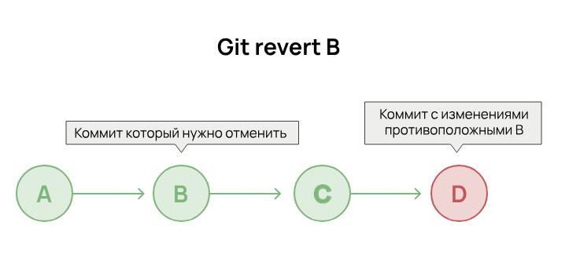
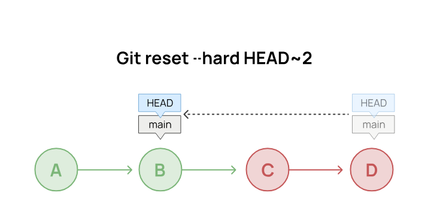
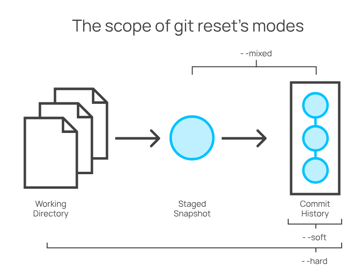
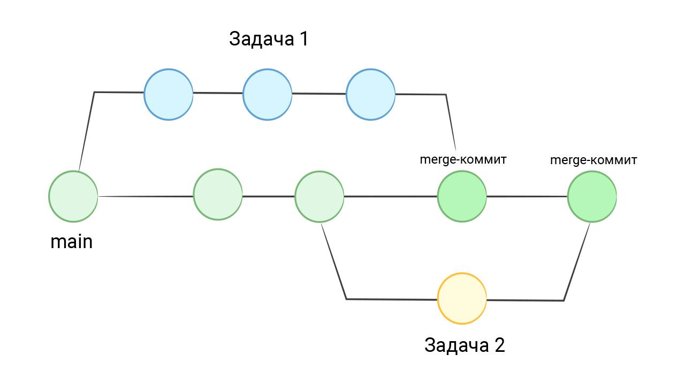

create a new branch
git branch newImage
The branch newImage now refers to the actual commit

Choose the branch for commiting
git checkout newImage
(git switch)

Create a new branch and check it out at the same time
git checkout -b name

Merging branch into main* (staying on main branch) - creates new merge commit on main*
git merge bugFix

urrent branch - git merge branch that you want merge with

Placed on bugFix aand merge with main

git checkout bufFix; git merge main

For combining commits with linear sequence. With bugFix selected
git rebase main

Now bugFix copies of commits move at the top of main branch (rebased onto main), so history is linear

Checked out on the main and rebase onto bugFix
Move the main branch reference forward on history

HEAD points to the current branch on the recent (last) commit

Detaching HEAD - attaching it to a commit instead of a branch.

Was:
HEAD -> main -> Commit1

Git checkout Commit1

Now:
HEAD -> Commit1

Changes are not effect of any branches

Relative refs
allow us use HEAD or branch name to moving on history

git checkout main^.  Find the parent of the specified commit. Now HEAD points on commits parent. This detach HEAD
Git cheackout commit2;
git checkout HEAD~3.   Num times moves HEAD to parents

-f option (not allowed for current branch) reasign a branch to a commit
git branch -f main HEAD~3
Moves by force the main branch to three parents behind HEAD

Rrvering changes

Revers changes by moving a branch reference backwars in time to an older commit.
git reset HEAD~1

Reverse last commit changes and share those with others - create commit with reversed changes:
git revert HEAD

git cherry-pick C1 C2 ...
Copy commits below HEAD (after - make them lasts)

Git Interactive Rebase
Git cherry-pick is great when you know which commits you want (and their hashes).

you don't know what commits you want? interactive rebasing -- review a series of commits you're about to rebase.

All interactive rebase - Git using rebase command with -i.
open up a UI to show you which commits are about to be copied below the target of the rebase.

reorder commits.
choose to keep all commits or drop specific ones. When the dialog opens, each commit is set to be included.
squashing (combining) commits, amending commit messages, editing the commits themselves.

git rebase -i HEAD~4

Git copied down commits in the same way you specified through the UI.

Locally stacked commits
track down a bug but it is quite elusive. In order to aid in my detective work, I put in a few debug commands and a few print statements.

All of these debugging / print statements are in their own commits. Finally I track down the bug, fix it, and rejoice!

need to get my bugFix back into the main branch. If I fast-forwarded main, then main get all my debug statements which is undesirable.

copy only one of the commits over.

git rebase -i
git cherry-pick

Juggling Commits
changes (newImage) and another set of changes (caption) that are related, so they are stacked on top of each other in your repository (aka one after another).

make a small modification to an earlier commit. change newImage, even though that commit is way back in history!

re-order the commits so the one we want to change is on top with git rebase -i
git commit --amend to make modification
Then re-order the commits back to how they were previously with git rebase -i
Finally move main to this updated part of the tree

Once the commit we wanted to change was on top, we could --amend it and re-order back to our preferred order.

git cherry-pick will plop down a commit from anywhere in the tree onto HEAD (as long as that commit isn't an ancestor of HEAD).

Git Tags
branches are easy to move around and often refer to different commits as work is completed on them.

permanently mark historical points in your project's history. For things like major releases and big merges, mark these commits with something more permanent than a branch?

Git tags permanently mark certain commits as "milestones" that you can then reference like a branch.

You can't "check out" a tag and then complete work on that tag -- tags exist as anchors in the commit tree that designate certain spots.

git tag v1 C1
(version 1)

Git Describe
tags serve as such great "anchors" in the codebase, git has a command to describe where you are relative to the closest "anchor" (tag).

get your bearings after you've moved many commits backwards or forwards in history; after you've completed a git bisect (a debugging search).

git describe <ref>

<ref> ('main' for example) is anything git can resolve into a commit. If you don't specify a ref, git uses where you're checked out right now (HEAD).

The output of the command:

<tag>-<numCommits>-g<hash>

tag is the closest ancestor tag in history, numCommits is how many commits away that tag is, and <hash> is the hash of the commit being described.

Rebasing Multiple Branches
rebase all the work from these branches onto main.

git rebase main bugFix
bugFix встанет за main
git rebase c2
ветка станет на коммит c2

Specifying Parents
Like the ~ modifier, the ^ modifier also accepts an optional number after it.

Rather than specifying the number of generations to go back (what ~ takes), the modifier on ^ specifies which parent reference to follow from a merge commit. merge commits have multiple parents, so the path to choose is ambiguous.

Git will follow the "first" parent upwards from a merge commit, but specifying a number with ^ changes this default behavior.

have a merge commit. If we checkout main^ without the modifier, we will follow the first parent after the merge commit.

git checkout main^ первый родитель (обычно ветка, в которую вливали изменения)
git checkout main^2 второй родитель (обычно ветка, которую влили)

HEAD or main эквивалентно можно использовать в командах

git branch -f three C2
ветку три переместить на коммит

история версий называется «Revision history». зафиксированное изменение в системе контроля версий называется ревизией.

Фиксация изменений создаёт ревизию, но сама ревизия может содержать внутри себя либо дельту изменений, либо снимок.

процесс переключения между ревизиями также имеет своё название. Когда мы загружаем конкретную ревизию, то говорят, что переключаемся на неё (checkout).

Между ревизиями можно выявлять различия в случае, если СКВ использует снимки, что демонстрирует нам Microsoft Word на картинке выше. Эту функциональность невозможно переоценить,поскольку посмотреть «а что же изменилось» требуется постоянно не только при работе с кодом. Приведу пример из собственной практики: согласование разных юридических документов (договоров) происходит сквозь череду правок. После того, как юристы поправили договор, хочется увидеть, а что же там изменилось.

diff index.js index2.js > index.patch

patch index.js -i index.patch -o index2.js
создание ревизии привязано к автосохранению, но это не единственная стратегия. Всего используется три способа:

Сохранение.
Автосохранение.
По кнопке (команде).
Последнее используется уже при работе с кодом.

исходный код, по сути, является набором текстовых (и бинарных) файлов. Кто, как и где будет их редактировать, заранее знать невозможно. автоматическое создание ревизий становится крайне неудобным.

В СКВ для кода процесс создания ревизии называется фиксацией (commit; разг. коммит). На работе вы будете часто слышать фразу «закоммитишь?» или «я закоммитил». обычно, вместо слова «ревизия» употребляют слово «коммит». И мы тоже так будем делать.

изменения в рамках одного коммита подчинялись определённым правилам. Только в таком случае можно будет воспользоваться всеми преимуществами СКВ.

повелительного наклонения в заголовке: «Fix scrolling» (Исправить прокрутку), а не «Fixed scrolling» (Исправлена прокрутка) или «Fixes scrolling» (Исправляет прокрутку).
Атомарность. Коммит решать одну задачу от начала до конца.  откатить изменение или перенести его в другую версию программы.

перед началом работы всегда выполнять git pull --rebase, скачивает из внешнего репозитория новые коммиты и добавляет их в локальный репозиторий.
вызывать git pull, к созданию ненужных коммитов, сложнее следить за историей изменений.
работа с git pull знания ветвление и git rebase.

git diff показывает разницу между тем, что было и что стало. запускает пейджер искать (/слово) внутри него нужные данные.
git diff не были добавлены в индекс.
git diff --staged # были добавлены в индекс

git diff обязательно запускать перед каждым коммитом. случайно добавляют в коммит то, что туда не должно попасть.

Хорошо сделанные коммиты имеют понятное описание, и каждый из них делает одну законченную вещь — история инструментом для анализа кода.

git log показывает список всех выполненных коммитов. вывод показывается через пейджер
git log -p # выводит диф для каждого коммита: все коммиты с полным дифом

git log -- file - в каких комитах менялся

У коммита — идентификатор («хеш»). посмотреть все изменения, сделанные в коммите:
git show 5120bea # диф между этим коммитом и предыдущим

не знаем коммита, кто последним менял строчку в файле? выводит файл и рядом с строчкой показывает кто ее менял и в каком коммите:

git blame INFO.md
e6f625cf (tirion 2020-09-17 16:14:09 -0400 1) git is awesome!
5120bea3 (tirion 2020-09-17 18:04:19 -0400 2) new line

git grep ищет совпадение с строкой во всех файлах проекта. знает про игнорирование и не смотрит в директорию .git, а еще умеет искать по истории:

git grep -i hexlet # без учета регистра
git grep Hexlet 5120bea # Поиск в коммите

git grep Hexlet $(git rev-list --all) # Поиск по истории. список хешей `rev-list`

откат изменений, в рабочей директории, но еще не попали в коммит. откат незакоммиченных изменений безвозвратен.

добавили новые файлы в репозиторий, что они вам не нужны.
# удалит все неотслеживаемые файлы
# -f – force, -d – directory
git clean -fd

# Отменяем Измененные файлы в рабочей директории
git restore INFO.md

С файлами, подготовленными к коммиту, — отменить изменения совсем, второй — отменить индексацию, не изменяя файлы в рабочей директории. изменения нужны, не хотим их коммитить сейчас:

git restore --staged INFO.md

git restore и окончательно отменить изменения

Git — система, в которой не нужно бояться совершать ошибки. Можно сказать, что ошибки — это единственный способ научиться им пользоваться. В Git практически всегда есть способ восстановить или изменить любые коммиты. На крайний случай спасет повторный git clone.

Что делать, если коммит уже сделан, но он нас по каким-то причинам не устраивает? Ситуаций может быть много, и все они возникают регулярно даже у профессиональных разработчиков:

Забыли добавить в коммит нужные файлы
Изменения нужно «откатить», чтобы доработать
Изменения больше не актуальны, и их нужно удалить
Изменения были сделаны по ошибке, и их нужно отменить
По большей части Git движется «только вперед». Правильный подход при работе с ним — это создавать новое, а не изменять старое.

Все ситуации, описанные выше, можно решить новым коммитом, изменяющим код в нужном направлении. Это не только удобно, но и безопасно. Изменение истории коммитов — опасная операция, которая чревата проблемами при синхронизации с удаленными репозиториями. Об этом мы поговорим позже.

Несмотря на сказанное выше, внутри Git существуют специальные команды, позволяющие упростить отмену, либо изменение коммита. С их помощью можно сделать историю коммитов понятной, а сам процесс отката — быстрым. Эти команды мы изучим в этом уроке.

Git revert
Самая простая ситуация — отмена изменений. Фактически она сводится к созданию еще одного коммита, который выполняет изменения, противоположные тому коммиту, который отменяется:

автоматизирующую откат. Эта команда называется git revert:

# Этой команде нужен идентификатор коммита
# Это коммит, которым мы удалили файл PEOPLE.md
git revert aa600a43cb164408e4ad87d216bc679d097f1a6c
# После этой команды откроется редактор, ожидающий ввода описания коммита
# Обычно сообщение revert не меняют, поэтому достаточно просто закрыть редактор
[main 65a8ef7] Revert "remove PEOPLE.md"
 1 file changed, 1 insertion(+)
 create mode 100644 PEOPLE.md
# В проект вернулся файл PEOPLE.md

git log -p

commit 65a8ef7fd56c7356dcee35c2d05b4400f4467ca8
Author: tirion <tirion@got.com>
Date:   Sat Sep 26 15:32:46 2020 -0400

    Revert "remove PEOPLE.md"

    This reverts commit aa600a43cb164408e4ad87d216bc679d097f1a6c.

diff --git a/PEOPLE.md b/PEOPLE.md
new file mode 100644
index 0000000..4b34ba8
--- /dev/null
+++ b/PEOPLE.md
@@ -0,0 +1 @@
+Haskell Curry
Команда revert может отменять не только последний коммит, но и любой другой коммит из истории проекта. Согласитесь, это очень круто. Без системы контроля версий о таком нельзя было и мечтать.

Команда git reset
Представьте, что вам нужно удалить только что сделанный по ошибке коммит. Конечно, и в этом случае подходит git revert, но так история становится менее читаемой. Если этот коммит был сделан только сейчас и еще не отправлялся на GitHub, то лучше сделать так, как будто бы этого коммита не существовало в принципе.

Git позволяет удалять коммиты. Это опасная операция, которую нужно делать только в том случае, если речь идет про новые коммиты, которых нет ни у кого, кроме вас.

Если коммит был отправлен во внешний репозиторий, например, на GitHub, то менять историю ни в коем случае нельзя. Это сломает работу у тех, кто работает с вами над проектом.

Для удаления коммита используется команда git reset:

# Добавляем новый коммит, который мы сразу же удалим
echo 'test' >> INFO.md
git add INFO.md
git commit -m 'update INFO.md'

[main 17a77cb] update INFO.md
 1 file changed, 1 insertion(+)
 # Важно, что мы не делаем git push

git reset --hard HEAD~

HEAD is now at 65a8ef7 Revert "remove PEOPLE.md"

# Если посмотреть `git log`, то последнего коммита там больше нет
У команды git reset есть множество различных флагов и способов работы. С ее помощью можно удалять коммиты, отменять их без удаления, восстанавливать файлы из истории и так далее. Работа с ней относится к продвинутому использованию Git, но здесь мы затрагиваем только самую базу.

Флаг --hard означает полное удаление. Без него git reset отменит коммит, но не удалит его, а поместит все изменения этого коммита в рабочую директорию, так что с ними можно будет продолжить работать.

Флаг HEAD~ означает «один коммит от последнего коммита». Обратите внимание, что здесь используется знак ~ — тильда. Его легко перепутать с дефисом -. Если бы мы хотели удалить два последних коммита, то могли бы написать HEAD~2:

HEAD (переводится как «голова») — так обозначается последний сделанный коммит. Подробнее эту терминологию мы разберем в уроке, посвященном внутреннему устройству Git.

Без --hard команда git reset по умолчанию работает в режиме --mixed, при котором изменения остаются в рабочей директории, но исключаются из индекса (unstage). Затем их можно исправить или отменить и выполнить новый коммит:

echo 'no code no pain' >> README.md
git add README.md
git commit -m 'update README.md'

[main f85e3a6] update README.md
 1 file changed, 1 insertion(+)

# Теперь откатываем последний коммит
git reset HEAD~

Unstaged changes after reset:
M   README.md

git status

On branch main
Your branch is up to date with 'origin/main'.

Changes not staged for commit:
  (use "git add <file>..." to update what will be committed)
  (use "git restore <file>..." to discard changes in working directory)
    modified:   README.md
Опция --soft позволяет сохранить изменения в индексе:

git reset --soft HEAD~1

git status

On branch main
Changes to be committed:
  (use "git restore --staged <file>..." to unstage)
    modified:   README.md

git reset --soft отменяет коммит, но оставляет изменения в индексе (staging area). Следующий коммит включит в себя те же изменения, если их не модифицировать.

Последнего коммита больше не существует. При этом сделанные в нем изменения не пропали. Они находятся в рабочей директории для дальнейшей доработки.

отменять, даже если допущена ошибка, всегда есть возможность её исправить.
git revert — безопасный способ отмены коммитов. Он создаёт новый коммит, который отменяет изменения предыдущего. не меняет историю коммитов.
git reset — мощный, но потенциально опасный инструмент. отменять коммиты, но при этом может изменить или удалить изменения:

git reset --soft оставляет изменения в индексе.
git reset --mixed (по умолчанию) снимает индексацию, но оставляет изменения в рабочей директории.
git reset --hard полностью удаляет изменения, и их нельзя восстановить без специальных команд.
Изменять историю коммитов нужно с осторожностью. Если коммиты уже отправлены в удалённый репозиторий, лучше использовать git revert, так как git reset может привести к проблемам при синхронизации с другими разработчиками.

подход в Git — двигаться вперёд. Если в коммите ошибка, проще сделать новый исправляющий коммит, чем менять историю.

Перед использованием git reset --hard важно убедиться, что важные изменения не будут потеряны.

разработчики делают коммит и сразу понимают, что забыли добавить часть файлов через git add. Оставшуюся часть изменений можно дослать следующим коммитом.

Есть еще один способ. Если изменения еще не были отправлены во внешнюю систему, можно добавить изменения в текущий коммит. Для этого во время коммита добавляется флаг --amend:

echo 'experiment with amend' >> INFO.md
echo 'experiment with amend' >> README.md
git add INFO.md
# Забыли сделать подготовку README.md к коммиту
git commit -m 'add content to INFO.md and README.md'

[main 256de25] add content to INFO.md and README.md
 1 file changed, 1 insertion(+)

git status

On branch main
Your branch is ahead of 'origin/main' by 1 commit.
  (use "git push" to publish your local commits)

Changes not staged for commit:
  (use "git add <file>..." to update what will be committed)
  (use "git restore <file>..." to discard changes in working directory)
    modified:   README.md

# забыли добавить файл

git add README.md
git commit --amend
# откроется редактор, ожидающий ввода описания коммита
# Здесь можно поменять сообщение или выйти из редактора, оставив старое

[main d96151a] add content to INFO.md and README.md
 Date: Sat Sep 26 16:02:07 2020 -0400
 2 files changed, 2 insertions(+)

--amend не добавляет изменения в существующий коммит. флаг к откату коммита через git reset и выполнению нового коммита с новыми данными. один коммит, git commit выполнялась два раза (первый раз — когда сделали ошибочный коммит).

не открывался редактор для ввода описания коммита к команде git commit --amend опцию --no-edit. описание коммита не изменится

Индекс в Git — это специальная промежуточная область, в которой хранятся изменения файлов на пути от рабочей директории до репозитория. При выполнении коммита в него попадают только те изменения, которые были добавлены в индекс. В этом уроке вы узнаете, зачем нужен индекс и как он работает.

Понятие индекса в Git появилось неслучайно. Даже когда разработчик работает над одной задачей, по пути он натыкается на разные проблемы в коде:

Ошибки
Код с плохим оформлением
Фрагменты, которые нужно будет исправить под новые требования
В большинстве ситуаций совершенно нормально исправлять эти недочеты, что все и делают. В итоге в рабочей директории появляется множество разных исправлений. Частично они относятся к выполняемой задаче, а частично — содержат множественные исправления, напрямую не связанные с основными изменениями. В чем здесь проблема?

Представим, что мы сделали ровно один коммит, в который включили и основную задачу, и дополнительные исправления. В таком случае, мы получаем несколько неприятных побочных эффектов.

Во-первых, становится сложнее смотреть историю. Коммит начинает содержать совершенно несвязанные изменения, которые отвлекают во время проверки чужого кода:

# Обычно в таких коммитах встречается условие И в описании
# Это показатель того, что в рамках одного коммита сделано несколько изменений
git commit -m 'add new feature and fix something'
Во-вторых, откат коммита по любым причинам приведет к тому, что откатятся правки, которые все равно нужно будет делать.

Именно здесь помогает индекс. Если он есть, мы можем не переживать, как сформируется коммит.

Стандартный способ работы с индексом — это добавление или изменение файлов и последующий коммит:

git add somefile
git commit -m 'add somefile'
Если речь идет про один-два файла, которые нужно закоммитить прямо сейчас, то можно сделать проще. Этот подход работает только с уже отслеживаемыми файлами:

echo 'new data' >> INFO.md
# Не нужно явно вызывать команду `git add`
git commit INFO.md -m 'update INFO.md'
Иногда бывает наоборот — мы исправили много файлов и хотим добавить их в коммит сразу все. Тогда поможет точка:

# Добавляет абсолютно все изменения рабочей директории в индекс
git add .
Команда выше очень опасна. С ее помощью крайне легко закоммитить много лишнего, особенно если перед коммитом не посмотреть git diff --staged.

Ну и совсем страшная, но полезная команда — это коммит с одновременным добавлением всего в индекс:

# Флаг -a автоматически добавляет все изменения рабочей директории в индекс
git commit -am 'do something'
разные изменения делаются в одних и тех же файлах. То есть изменения в этих файлах по-хорошему должны находиться в разных коммитах.

git add -i, показывает измененные куски файлов и спрашивает, что с ними сделать:

выбрать то, что должно попасть в коммит, а что нет.

Git позволяет не только просматривать историю. Еще мы можем перемещаться по истории, загружая в рабочую директорию состояние кода на момент выполнения любого коммита. В этом уроке мы изучим, как перемещаться по истории с помощью команды git checkout.

Для начала воспользуемся командой git log:

# Показывает сокращенный вывод
git log --oneline

fc74e2d update README.md
65a8ef7 Revert "remove PEOPLE.md"
5120bea add new content
e6f625c add INFO.md
273f81c remove NEW.md
aa600a4 remove PEOPLE.md
fe9893b add NEW.md
3ce3c02 add PEOPLE.md
3c5d976 add README.md
Переключимся на момент, когда был выполнен коммит с сообщением add INFO.md. Для этого используем команду git checkout <хеш коммита>:

git checkout e6f625c

Note: switching to 'e6f625c'.

You are in 'detached HEAD' state. You can look around, make experimental
changes and commit them, and you can discard any commits you make in this
state without impacting any branches by switching back to a branch.

Or undo this operation with:

  git switch -
Выполните команду выше и изучите рабочую директорию. Обратите внимание, что хеш вашего коммита может отличаться. Вы увидите, что пропала часть изменений из-за возврата в прошлое. Сами изменения никуда не делись, и мы снова можем вернуться на последний коммит следующей командой:

# Позже мы поговорим, что такое main
git checkout main
Переключившись в нужный коммит, можно не только изучить содержимое репозитория. Еще мы можем забрать какие-то изменения, которые были удалены, но снова понадобились для работы. Для этого достаточно их скопировать, переключиться на последний коммит и вставить в нужный файл.

Команда git branch
Переключение по коммитам отражается только на содержимом рабочей директории. Больше нигде не видно, где мы находимся. Из-за этого немало программистов забывают, где они находятся. Они начинают работать и очень удивляются, когда не получается выполнить коммит.

Самый простой способ узнать место нахождения — вызвать команду git branch. В обычной ситуации, когда мы находимся на последнем коммите, Git покажет такой вывод:

git branch

# Позже мы поговорим, что такое main
* main
Но если прямо сейчас загружен коммит из прошлого, то вывод станет таким:

* (HEAD detached at e6f625c)
  main
Такой способ проверки текущего местоположения требует постоянного внимания. Нужно не забывать его использовать. Конечно же, все забывают это делать, поэтому гораздо надежнее и удобнее вывести текущее местоположение прямо в командной строке. Например, так:

# Если на последнем коммите
hexlet-git git:(main)

# Если на коммите из прошлого
hexlet-git git:(e6f625c)
Именно так делают большинство профессиональных разработчиков. Как добиться такого вывода? Ответ на этот вопрос зависит от используемого командного интерпретатора:

В Bash вывод местоположения происходит благодаря редактированию переменной окружения $PS1
https://ru.hexlet.io/blog/posts/kak-prisoedinitsya-k-rabote-nad-opensorsom-chto-takoe-ps1-i-drugie-voprosy-otvechaet-razrabotchik-heksleta-andrey-moshkov#chto-takoe-ps1-i-dlya-chego-ispolzuetsya

Обилие команд и возможностей могут повергнуть в ужас любого, кто только начинает изучать Git. Git — это комбайн с невероятным количеством фич. Но надо ли знать их все? И как их запомнить? Как вообще научиться эффективно его использовать? В этом уроке мы ответим на эти вопросы.

Правда состоит в том, что почти никто не знает Git до конца. Разработчики регулярно открывают внутри него что-то новое, а еще постоянно гуглят его команды или смотрят документацию. Единственный способ изучить Git — постоянно использовать его. Причем наибольший эффект достигается при работе с Git в команде. Одиночная разработка в этом смысле сильно уступает, так как не затрагивает многих сложных ситуаций, возникающих только при совместной работе над одним и тем же кодом.

С другой стороны, чтобы освоить Git, нужно понять, как он устроен и на каких идеях базируется. После этого вы осознаете, что подавляющее большинство команд — это всего лишь обертки над очень простой концепцией.

Для начала давайте выведем коммиты нашего проекта hexlet-git в специальном виде, который активируется опцией --graph:

git log --graph

# Неполный вывод, чтобы не отвлекаться от сути
* commit e7bb5e51f96e572084f6c04ba3312e32ce6b8c0f (HEAD -> main, origin/main, origin/HEAD)
|
|     update README.md
|
* commit 65a8ef7fd56c7356dcee35c2d05b4400f4467ca8
|
|     Revert "remove PEOPLE.md"
|
|     This reverts commit aa600a43cb164408e4ad87d216bc679d097f1a6c.
|
* commit 5120bea3e5528c29f8d1da43731cbe895892eb6d
|
|     add new content
|
* commit e6f625cf8433c8b1f1aaed58cd2b437ec8a60f27
|
|     add INFO.md
|
* commit 273f81cf2117044f1973ea80ce1067a94bea3f80
|
|     remove NEW.md
Обратите внимание на полоску слева. Она отражает связи между коммитами. Каждый новый коммит базируется на коде предыдущего коммита. С точки зрения информатики коммиты выстраиваются в так называемый односвязный список. В таком списке каждый элемент ссылается на предыдущий. Последний элемент при этом называется головой списка (head по-английски).

В Git элементы списка — это сами коммиты. Как и в односвязном списке, новый коммит — это элемент, который имеет ссылку на предыдущий коммит. Предыдущий коммит ссылается на свой предыдущий, и так далее до первого коммита, который никуда не ссылается.

Понятие «голова списка» (HEAD) в Git присутствует явно и активно используется для разных операций. Например, удаление последнего коммита выглядит так:

# HEAD~1 означает: взять голову и удалить один коммит, начиная от нее
# То есть мы удаляем только последний коммит
git reset --hard HEAD~1
Сам список коммитов тоже имеет название. Вы его уже видели — это main. В терминологии Git такой список называется веткой (branch). Именно поэтому команда для показа текущего местоположения в истории называется git branch:

git branch

* main
Строго говоря, ветка в Git — это просто подвижный указатель на один из коммитов. При каждом новом коммите указатель сдвигается вперед автоматически.

работа Git — формировать односвязный список из коммитов. Подавляющее большинство команд Git — это всего лишь небольшие программы, которые умеют ходить по этому списку и извлекать нужную информацию. Фактически все сводится к тому, что мы блуждаем по этому списку, меняем его и добавляем новые коммиты.

Ветки
цепочка коммитов в Git это не просто односвязный список. направленный ациклический граф — множество односвязных списков, переплетенных вместе.

в один момент два разных человека должны делать какие-то длинные задачи, требующие нескольких дней разработки или даже больше. В таком случае main-ветка должна оставаться рабочей: коммитить промежуточные изменения в нее нельзя, так как изменения могут сломать код. Но коммитить все равно надо, потому что просто небезопасно копить изменения в рабочей директории, не отправляя их в Git. Что делать в такой ситуации?

Git позволяет отпочковаться от основного списка — сформировать ветку. создается отдельный список коммитов, который идет мимо главной ветки. В конце разработки все коммиты из такой ветки вливаются обратно в main-ветку:

В процессе работы над любым проектом в директории с кодом создаются файлы, которые не являются частью исходного кода. Все эти файлы можно условно разделить на несколько групп:

Инструментарий
Служебные файлы, добавляемые операционной системой — например, .DS_Store в MacOS
Конфигурационные и временные файлы редакторов — например, .idea или .vscode
Временные файлы
Логи — в них содержится полезная информация для отладки, которая собирается во время запуска и работы приложения
Кеши — файлы, которые нужны для ускорения разных процессов
Артефакты
Результаты сборки проекта — например, после компиляции или сборки фронтенда
Зависимости, которые устанавливаются во время разработки — например, node_modules или vendor
Результаты выполнения тестов — например, информация о покрытии кода тестами
Все это в обычной ситуации не должно попадать в репозиторий. В этом уроке вы узнаете, как проигнорировать эти файлы.

Как правило, эти файлы не несут никакой пользы с точки зрения исходного кода. Они создаются:

Автоматически (кеши, логи)
По запросу (например, скачиваются зависимости или собирается проект)
Главная проблема с этими файлами в их постоянном изменении — особенно при очень больших размерах проекта. Если добавлять их в репозиторий, то практически в каждом коммите будут не только изменения исходного кода, но и пачка изменений в этих файлах. Читать историю таких коммитов крайне сложно.

Git позволяет гибко настраивать игнорирование определенных файлов и директорий. Делается это с помощью файла .gitignore, который нужно создать в корне проекта. В этот файл с помощью текстового редактора добавляются имена файлов и директорий, которые надо игнорировать:

# В этом файле можно оставлять комментарии
# Имя файла .gitignore
# Файл нужно создать самостоятельно

# Каждая строчка — это шаблон, по которому происходит игнорирование

# Игнорируем файл в любой директории проекта
access.log

# Игнорируем директорию в любой директории проекта
node_modules/

# Игнорируем каталог в корне рабочей директории
/coverage/

# Игнорируем все файлы с расширением sqlite3 в директории db
# При этом не игнорируются такие же файлы внутри любого вложенного каталога в db
# Например, /db/something/lala.sqlite3
/db/*.sqlite3

# Игнорировать все .txt файлы в каталоге doc/ на всех уровнях вложенности
doc/**/*.txt

Git поддерживает игнорирование файлов, но сам его не настраивает. Для игнорирования файлов и директорий, создать файл .gitignore в корне проекта и добавить его в репозиторий.
Продолжим работать с .gitignore:

touch .gitignore
# Добавляем в файл правила игнорирования по примеру выше
git add .gitignore
git commit -m 'update gitignore'

Как только .gitignore создан и в него добавлен какой-то файл или директория, игнорирование заработает автоматически. Все новые файлы, попадающие под игнорирование, не отобразятся в выводе команды git status.

случайно уже добавил в репозиторий файл, который нужно проигнорировать. недостаточно обновить правила игнорирования. удалить файл или директорию из Git с помощью git rm и закоммитить.
git rm file -- cached - удалить фалй из репозитория(гит перестанет его отслеживать), файл останется в рабочей директории.

работаете над какой-то важной задачей и исправили довольно много файлов. В этот момент появляется срочная задача — сделать какое-то изменение в исходном коде, не связанное с тем, над чем вы сейчас работаете. Ваши изменения еще не готовы, и они не должны попасть в репозиторий. Что делать? В этом уроке мы разберем команду, которая поможет в этом случае.

В самом простом случае, ваши изменения не пересекаются с изменениями по срочной задаче. В таком случае вы можете внести исправления, добавить их в индекс, закоммитить и запушить. Но обычно это неудобно и не всегда возможно. А если изменения нужно делать в тех файлах, с которыми вы работаете прямо сейчас?

Подобная ситуация у опытных разработчиков встречается регулярно. К счастью, она легко решается. В Git существует набор команд, позволяющий прятать изменения в рабочей директории и восстанавливать их при необходимости. Попробуем:

touch FILE.md
git add FILE.md
git status

On branch main
Your branch is up to date with 'origin/main'.

Changes to be committed:
  (use "git restore --staged <file>..." to unstage)
    new file:   FILE.md

# Прячем файлы
# После этой команды пропадут все измененные файлы
# независимо от того, добавлены они в индекс или нет
git stash

Saved working directory and index state WIP on main: e7bb5e5 update README.md

git status

On branch main
Your branch is up to date with 'origin/main'.

nothing to commit, working tree clean
Команда git stash не удаляет файлы. Они попадают в специальное место внутри директории .git на временное хранение. Эта команда не трогает новые файлы, так как они еще не являются частью репозитория:

После выполнения всех нужных изменений в чистой рабочей директории можно вернуть спрятанные изменения с помощью команды git stash pop:

# Восстанавливаем
git stash pop

On branch main
Your branch is up to date with 'origin/main'.

Changes to be committed:
  (use "git restore --staged <file>..." to unstage)
    new file:   FILE.md

Dropped refs/stash@{0} (b896d4a0126ef4409ede63857e5d996953fe75c5)

# Проверяем
git status

On branch main
Your branch is up to date with 'origin/main'.

Changes to be committed:
  (use "git restore --staged <file>..." to unstage)
    new file:   FILE.md
Файлы вернулись в том виде, в котором они попали в стэш (stash).

Стэш в Git работает по принципу стека. Он позволяет сохранить внутрь любое количество изменений и восстановить их в обратном порядке:

git stash

# Изменяем файлы
git stash

# Возвращаем последние изменения
git stash pop

# Возвращаем предпоследние изменения
git stash pop

Проекты с открытым исходным кодом или OpenSource (Open Source Software, OSS) — это программное обеспечение с общедоступным кодом. Любой пользователь может увидеть код, а в большинстве случаев — даже повлиять на него.

К такому ПО относятся:

Прикладное ПО и сервисы, как VSCode или Git
Огромное число библиотек в нашем коде
Практически все современные языки программирования
Современные проекты огромны:

Linux (> 12 000 000 строк кода)
Chromium (> 16 000 000 строк кода)
Та скорость, с которой разрабатываются такие крупные проекты, возможна благодаря программам и библиотекам с открытым исходным кодом.

Откуда вообще берутся опенсорс-проекты, и почему они так популярны? Почти всегда такой код появляется как побочный продукт разработки других проектов. Например, в процессе разработки Linux появилась необходимость в удобной программе для управления версиями — так появился Git.

Но почему его код был открыт? Ответ достаточно простой. Удачные проекты привлекают множество разработчиков, которые помогают им развиваться. Они пишут отчеты об ошибках, присылают исправления и даже становятся полноправными разработчиками. И все это бесплатно. Разработчики удовлетворяют свое эго и радуются тому, что создают нечто новое и вообще помогают этой Вселенной. Как побочный эффект, такие разработчики гораздо легче находят работу и имеют более прокачанные навыки кодирования, чем их коллеги, которые не работают с открытыми проектами.

Если вы вернетесь в прошлое и посмотрите, сколько людей раньше работало над опенсорс-проектами, то вы увидите огромный разрыв с современным положением дел.

Сложное включение в разработку, сложное принятие изменений — вот неполный перечень проблем, с которыми сталкивались участники опенсорс-движения. Раньше было нормой, что люди выступали с докладами на конференциях, где час описывали правила принятия людей и кода от них в проект.

Сейчас присоединиться к опенсорс-проекту можно за пару минут. Можно начать где-то участвовать, не нужно прилагать практически никаких усилий. Случилось это благодаря двум составляющим: Git и GitHub.

Один из важнейших механизмов GitHub — запрос на включение изменений. Коротко его называют пулреквест (pull request). Именно этот механизм позволяет легко и непринужденно вливаться в разработку любых проектов.

Допустим, работая с определенной библиотекой, мы заметили ошибку в коде или документации. Пройдемся по шагам, которые необходимо выполнить для исправления этой ошибки. Наша конечная цель — чтобы разработчики библиотеки приняли код.

Клонирование
Первым шагом создаем копию репозитория в своем аккаунте. Делается это буквально одной кнопкой Fork на странице репозитория:

После этого действия в вашем аккаунте окажется репозиторий с таким же именем. GitHub знает, что это копия оригинального репозитория, и помечает его особым образом.

клонируем репозиторий на компьютер и производим необходимые изменения. делать изменения в отдельной ветке, созданной от ветки main.

Запрос на включение изменений кода
После того как мы залили изменения на GitHub, в его интерфейсе произойдут изменения. На странице склонированного репозитория появится кнопка Pull request:

Если ее нажать, то откроется страница, на которой можно указать название пулреквеста и его описание.

После отправки пулреквеста в оригинальном репозитории на странице Pull requests отобразится ваш запрос.

GitHub позволяет сделать пулреквест прямо из своего интерфейса.

открыть файл и нажать на иконку редактирования. После завершения редактирования GitHub предложит создать пулреквест с этим изменением.
