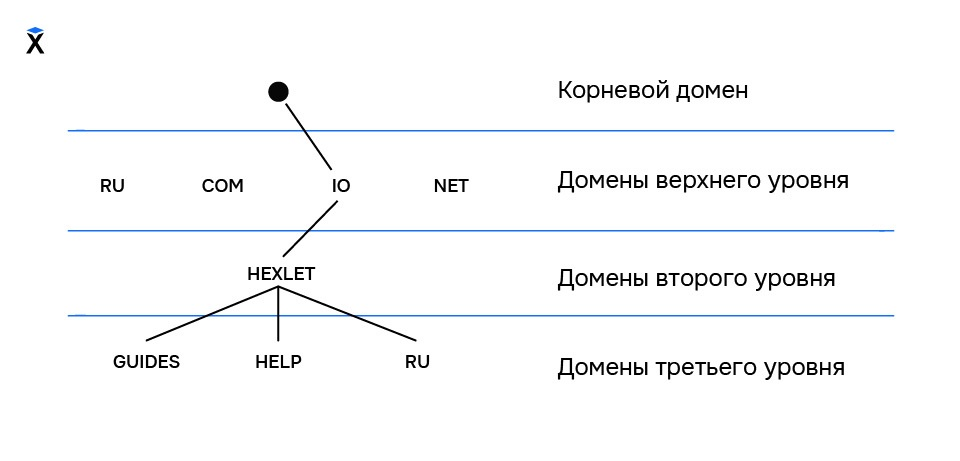
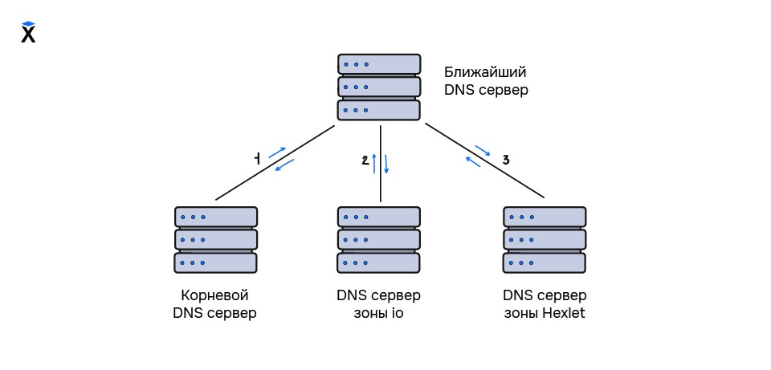
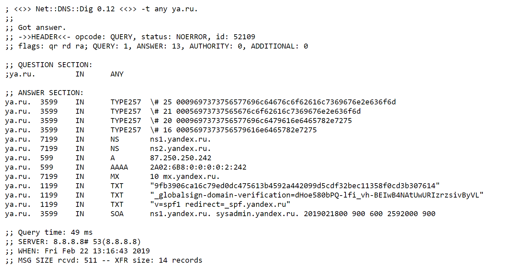

как браузер понимает, какую страницу открыть, когда вводите в строку адрес сайта?

В 70-х — 90-х годах 20 века существовала сеть под названием ARPANET.
сеть объединяла компьютеры в четырёх различных институтах США:

передавать друг другу информацию об исследованиях удобнее при помощи новой сети. знать идентификатор того компьютера, на который передаётся сообщение. Сейчас такие идентификаторы называются IP-адресами. У каждого устройства в интернете есть такой идентификатор и именно по нему обращаются устройства друг к другу.

В начале компьютеров, подключённых к сети, было несколько десятков, и их идентификаторы было легко запомнить. Можно было записать идентификаторы в блокнот и использовать его так же, как и телефонные книги.

каждый из них имел уникальный идентификатор, который становилось всё сложнее учитывать вручную или запоминать. очеловечить имена компьютеров и хранить все адреса в одном месте, чтобы каждый компьютер в сети имел один и тот же набор всех идентификаторов.

словарь, который связывал уникальное имя и IP каждого компьютера. hosts.txt, отвечал за привязку IP к имени компьютера. Файл лежал на сервере Стэнфордского исследовательского института, и пользователи регулярно вручную скачивали этот файл на свои компьютеры, чтобы сохранять актуальность словаря, ведь новые компьютеры появлялись в сети почти каждый день.

192.168.10.36 MIKE-STRATE-PC Сетевой (IP) адрес Имя компьютера
При наличии такого файла на компьютере пользователя для связи с компьютером Майка, можно было не запоминать цифры, а использовать понятное латинское имя «MIKE-STRATE-PC».

добавить новое имя, подключиться к компьютеру с использованием данного имени. отредактируем файл hosts. Вы можете найти его на своём компьютере по следующему адресу:

В Unix-системах: /etc/hosts
В Windows-системах: %Путь до папки Windows%/system32/drivers/etc/hosts

Компьютеру с IP-адресом 192.168.10.36, который находится внутри локальной сети мы указали имя «MIKE-STRATE-PC». После чего можно воспользоваться командой ping, которая пошлёт специальный запрос на компьютер Майка и будет ждать от него ответа. Похоже на то, как вы стучитесь в дверь или звоните в звонок, чтобы узнать, «есть ли кто дома?» запрос можно послать на любой компьютер.

Всем пользователям компьютеров было необходимо всё чаще скачивать свежую версию файла с сервера Стэнфордского исследовательского института, который обновлялся вручную несколько раз в неделю. Для добавлений же новых версий было необходимо связываться с институтом и просить их внести в файл новые значения.

DNS (Domain Name System), автоматизировать процессы соотнесения IP-адресов и имён компьютеров, процессы обновления имён у пользователей без ручного скачивания файла со стороннего сервера.

Как работает DNS сервер в интернете
для корректной связи с ними нужна система, пользователи смогут одним запросом в адресной строке подключиться к нужному сервису. ДНС внутри хранит больше информации, чем IP-адрес и название устройств. Записи отвечают за отправку электронных писем, связывают домены и доменные зоны.

ДНС распределённой системой, имеет множество узлов, каждый из которых ответственен за свою зону. структура ДНС иерархической, выделяет зоны ответственности, где каждый родитель знает о расположении своего дочернего сервера, и знает зону его ответственности.

компонентами ДНС являются:

Домен (доменное имя) — символьное имя для обозначения сервера в интернете. Доменные имена являются иерархической структурой, в которой каждый уровень отделяется точкой. Основными уровнями являются:

Корневой домен. В урле он не используется, но всегда подразумевается. От него начинается построение всех урлов в интернете
Домены верхнего уровня. К ним относятся .ru, .com, .net, .su и так далее. Также его называют доменом первого уровня.
Домен второго уровня (или основной). Это основное имя вашего сайта
Поддомены (третьего, четвёртого, пятого и т.д. уровня). Сюда входят все поддомены основного домена.
DNS-сервер — система, ответственная за хранение и поддержание в актуальном состоянии записей о своих дочерних доменах. Каждый сервер ответственен только за свою зону, то есть ДНС-сервер домена .io знает о том, где расположен домен hexlet, ДНС-сервер которого знает о расположении своих поддоменов.

Корневой DNS-сервер — система, знающая расположение (IP-адреса) ДНС-серверов доменов верхнего уровня.

Ресурсная запись — единица информации ДНС-сервера. Каждая ресурсная запись имеет несколько полей:

Имя (домен, к которому относится запись)
Тип
Параметры
Значение
Подключение

доменное имя — абстракция для людей. компьютер и приложения (браузер) обращается к сервисам внутри сети интернет по IP-адресам.

процесс получения IP-адреса по доменному имени на примере домена ru.hexlet.io.

Компьютер посылает запрос на известный ему DNS-сервер. Чаще всего им является ДНС-сервер поставщика интернет-услуг (провайдера): какой IP-адрес у домена ru.hexlet.io?. DNS-сервер провайдера находит в своей базе информацию о том, что домен ru.hexlet.io расположен по IP-адресу 104.25.238.104 и возвращает значение нашему компьютеру. Этот процесс похож на то, как использовался файл hosts.txt.

Ближайший известный DNS-сервер не имеет записи о том, по какому IP-адресу располагается домен ru.hexlet.io. В таком случае запускается цепочка процессов, благодаря которым наш компьютер получит IP-адрес домена:

домен является иерархической структурой, и все DNS-сервера знают IP-адреса корневых DNS-серверов, то к ним и происходит запрос на получение IP-адреса домена.
Корневые DNS-сервера, в соответствии со своей зоной ответственности знают о том, где располагаются DNS-сервера доменов верхнего уровня. Эти адреса возвращаются DNS-серверу нашего провайдера, после чего на нужный DNS-сервер (в нашем случае на DNS-сервер домена .io) посылается запрос на получение IP-адреса домена ru.hexlet.
В соответствии со своей зоной ответственности DNS-сервер домена верхнего уровня возвращает IP-адрес DNS-сервера домена hexlet, на который посылается запрос на получение IP-адреса поддомена ru.
DNS-сервер возвращает IP-адреса поддомена ru, после чего DNS-сервер нашего провайдера возвращает полученный адрес на наш компьютер, который уже может обратиться к домену ru.hexlet.io по его IP-адресу.
Рекурсия в DNS
оба описанных выше варианта сильно различаются: в первом случае мы просто послали запрос и получили ответ, а во втором — возникла необходимость идти от самого корневого домена в процессе поиска нужной нам записи. Такой процесс является рекурсивным, потому что ближайший DNS-сервер непрерывно посылает запросы к другим DNS-серверам до тех пор, пока не получит необходимые ресурсные записи. Данный процесс можно визуализировать следующим образом:

При запросах 1 и 2 ближайший сервер будет получать информацию о местонахождении DNS-серверов, которые входят в зону ответственности того сервера, на который был послан запрос. При запросе 3 будут получены необходимые ресурсные записи домена hexlet и его поддоменов.

Рекурсивный поиск — это достаточно долгая операция, которая к тому же сильно нагружает сеть и сами DNS-сервера. избавиться от рекурсии каждый DNS-сервер кеширует информацию о записях, которые получает, для быстрой отдачи этой информации пользователю.

Как видно, рекурсивный поиск предполагает нахождение конечного ответа на наш запрос путём поиска записи по всем необходимым DNS-серверам, начиная с корневого. В противовес такому способу также существует итеративный запрос, который в отличие от рекурсивного выполняет всего лишь одну итерацию — это запрос ближайшему DNS-серверу, от которого мы можем получить как закешированный ответ, так и данные той зоны, за которую он ответственен. Важно отметить, что итеративный запрос предполагает всего один такой запрос.

в интернете DNS-сервера умеют посылать рекурсивные запросы, потому что в таком случае ответ можно закешировать, что в дальнейшем позволит снизить нагрузку как на сам сервер, так и на другие сервера. Время, на которое DNS-сервер кеширует информацию, указывается в ресурсной записи ДНС, о которой сейчас пойдёт речь.

Ресурсные записи DNS
интернет подразумевает не только получение IP-адреса по доменному имени, но и пересылку электронной почты, подключение дополнительных сервисов аналитики к сайту, настройку защищённого протокола HTTPS. Это чаще всего делается с помощью ресурсных записей ДНС.

какие ресурсные записи используются, и на что они указывают. Основными ресурсными записями ДНС являются:

A-запись — одна из самых важных записей. Именно эта запись указывает на IP-адрес сервера, который привязан к доменному имени.

MX-запись — указывает на сервер, который будет использован при отсылке доменной электронной почты.

NS-запись — указывает на DNS-сервер домена.

CNAME-запись — позволяет одному из поддоменов дублировать DNS-записи своего родителя. перенаправить запрос с одного домена на другой (чаще всего для перенаправления домена с поддоменом www на домен без такого поддомена).

TXT-запись — в этой записи хранится текстовая информация о домене. для подтверждения прав на владение, посредством добавления определённой строки, которую присылает нам интернет-сервис.

Ресурсные записи почти всегда одинаковые, но для некоторых записей могут появляться другие поля, например в MX-записях также присутствует значение приоритета. В основном ресурсные записи имеют следующую структуру:

Имя записи TTL Класс Тип записи Значение
Разберём подробнее:

Имя записи — указывается домен, которому принадлежит данная ресурсная запись.

TTL (time to live / время жизни) — время в секундах, на которое будет закешировано значение ресурсной записи. Это необходимо для разгрузки DNS-серверов. Благодаря кешированию и возможна ситуация, что ближайший DNS-сервер знает IP-адрес запрашиваемого домена.

Класс — предполагалось, что DNS может работать не только в интернете, поэтому в записи указывается и её класс. На сегодняшний день поддерживается только одно значение — IN (Internet).

Тип — указывает тип ресурсной записи, основные из которых были разобраны выше.

Значение — значение ресурсной записи. В зависимости от типа ресурсной записи значения могут быть представлены в разном виде.

в каком виде эти записи хранятся на DNS-серверах на примере домена ya.ru. Для этого воспользуемся утилитой dig, которая получает все доступные ресурсные DNS-записи от DNS-сервера и выводит их пользователю.

Утилита dig является DNS-клиентом и входит в состав одного из самых распространённых DNS-серверов BIND.

Пример реальных записей DNS

Вывод из нескольких частей:

Шапка
Секция запроса
Секция ответа
Служебная информация
Шапка запроса

; <<>> Net::DNS::Dig 0.12 <<>> -t any ya.ru. ;; ;; Got answer. ;; ->>HEADER<<- opcode: QUERY, status: NOERROR, id: 52109 ;; flags: qr rd ra; QUERY: 1, ANSWER: 13, AUTHORITY: 0, ADDITIONAL: 0
Здесь указывается проставленные флаги нашего запроса, количество запросов и ответов, а также другая служебная информация.

Секция запроса

;; QUESTION SECTION: ;ya.ru. IN ANY
В секции запроса указывается домен, к которому происходит обращение, класс записи и те записи, которые мы хотим получить. ANY указывает на то, что нужно вывести все доступные ресурсные записи, но если вы хотите поэкспериментировать с утилитой сами, то можете с помощью специального ключа получить вывод только конкретных записей, которые интересуют в настоящий момент.

Секция ответа

Секция ответа достаточно большая, поэтому для удобства разобьём её по типам ресурсных записей.

;; ANSWER SECTION: ya.ru. 7199 IN NS ns1.yandex.ru. ya.ru. 7199 IN NS ns2.yandex.ru. ya.ru. 599 IN A 87.250.250.242 ya.ru. 599 IN AAAA 2A02:6B8:0:0:0:0:2:242
Как запись A, так и AAAA-запись указывают на IP-адрес, который привязан к нашему домену. A-запись указывает IP в формате IPv4, а запись AAAA — в формате IPv6.

ya.ru. 7199 IN MX 10 mx.yandex.ru.
MX-запись также имеет параметр приоритета. Так как серверов для отправки почты может быть несколько, то и записей может быть много, поэтому для определения основного сервера указывается приоритет записи. Чем меньше число, тем выше приоритет.

ya.ru. 3599 IN SOA ns1.yandex.ru. sysadmin.yandex.ru. 2019021800 900 600 2592000 900
Запись SOA (Start of Authority) указывает на несколько различных параметров:

Сервер с эталонной информацией о текущем домене
Контактную информацию ответственного лица
Различные параметры кеширования записей
Бывают и некоторые более специфичные ресурсные записи. перечень записей найти в документации (по DNS-серверу BIND).

DNS-сервера сейчас составляют основу всего интернета и используются почти в каждом действии пользователя, будь то переход на сайт, отправка электронной почты, работы с интернет-приложением на телефоне. ресурсных записях, благодаря которым и возможно перемещение по интернету, являются важными для разработчика.
