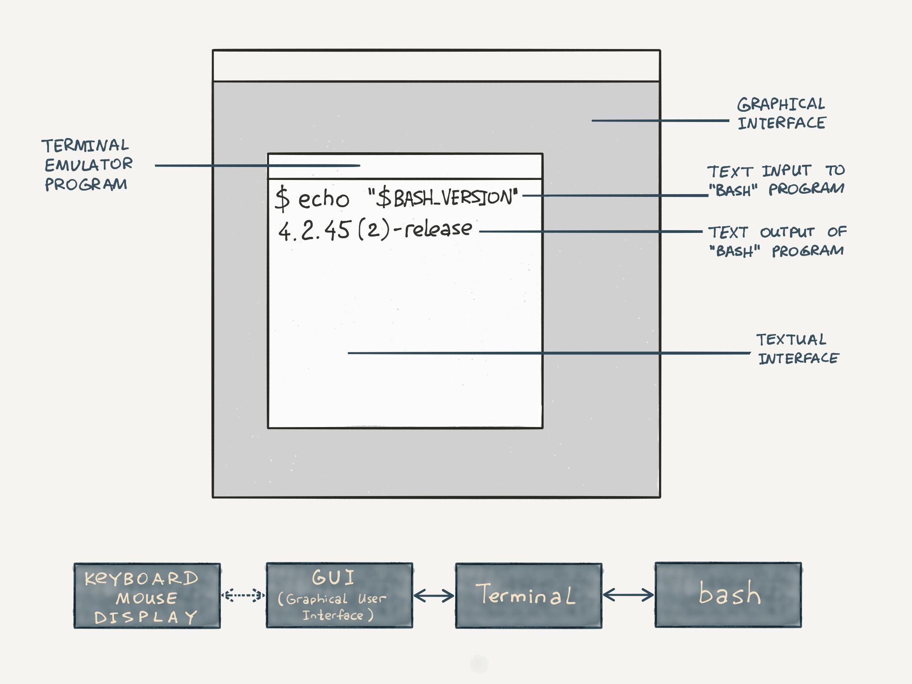
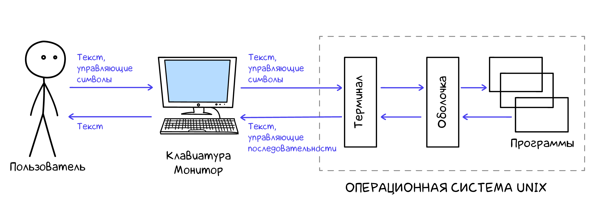

https://white55.ru/cmdmain.html

Терминалом программу, эмулирует поведение железного терминала из клавиатуры и монитора. окошко с командной строкой внутри:

Командная оболочка — программа, через которую пользователь управляет ОС и установленными программами, используя командную строку. (shell, командный интерпретатор).

Оболочка — средство для выполнения определенных задач, а не сама задача.

Внутри терминала пользователь передает системе строки:

Оболочка запускается внутри терминала и приглашает ко вводу команд

Командная оболочка позволяет запускать на выполнение установленные программы.

Терминал — программа, запускает командную оболочку внутри себя:

В Windows файловая структура представлена несколькими деревьями, каждая структура находится на своем диске. В *nix-системах единственное дерево с корнем в /. устройства, физические и логические диски находятся внутри дерева в виде директорий и файлов.

Информация о файле или директории по команде stat (file system status)

Директория — специальный файл, содержит список файлов. подключаемое устройство становится файлом или директорией, если это накопитель.
печать на принтер и вывод на экран не отличаются — с точки зрения кода - запись в файл.

В *nix-системах FHS — стандартизированный набор каталогов.
/etc содержит конфигурацию программ в текстовых файлах.
/home содержит домашние директории пользователей системы, за исключением root, домашний каталог которого по адресу /root

Hard Link — доп имя для уже сущ файла
Symbolic link — символическая ссылка. файл похож на ярлык в Windows. Если удалить основной файл, символическая ссылка вести в никуда
Socket — специальный файл, через который взаимодействие между разными процессами ОС.

логи — текстовые файлы, в которые заносится информация о происходящих процессах в ОС.
в каталоге /var/log. Основной файл логов Linux называется syslog.

В WSL syslog установите его:
sudo add-apt-repository ppa:adiscon/v8-stable
sudo apt-get install rsyslog
sudo service rsyslog start.

tail -f path/to/file выводит последние строчки файла, но и ждет появления новых.

категория программ для просмотра содержимого файла и поиска по нему, только в режиме чтения — пейджеры.
sudo less syslog
