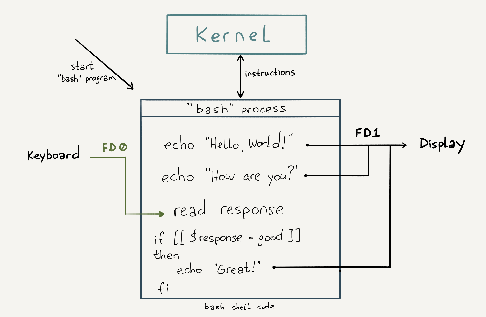
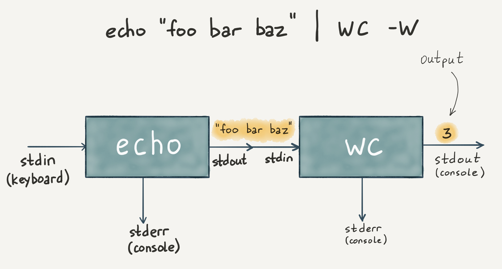
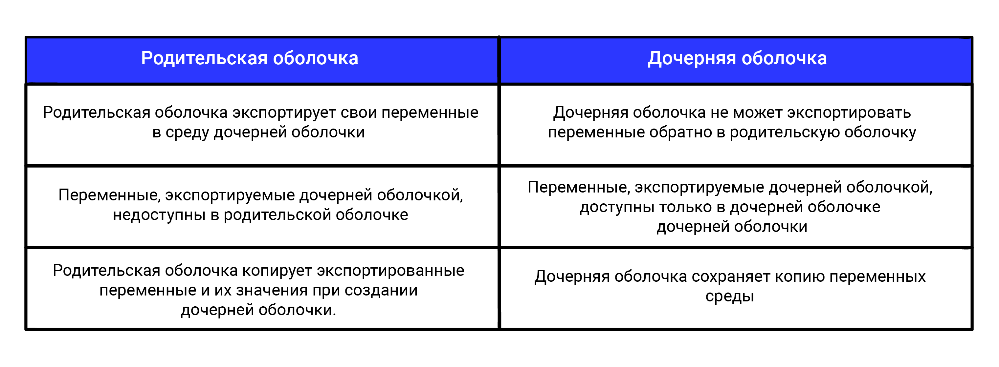
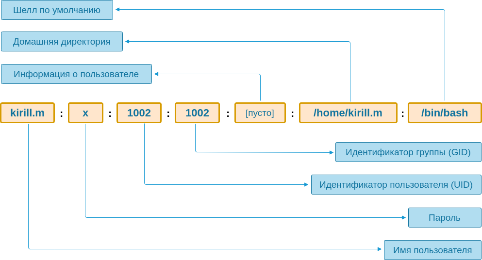
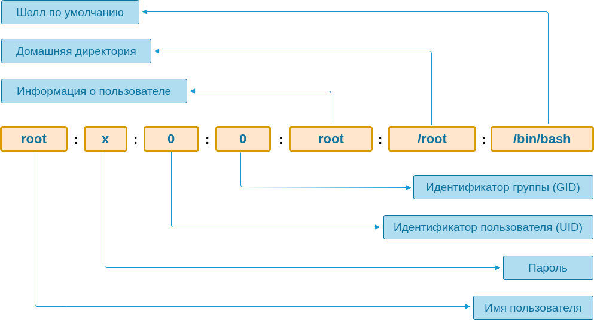
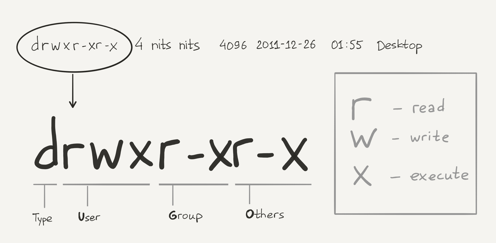
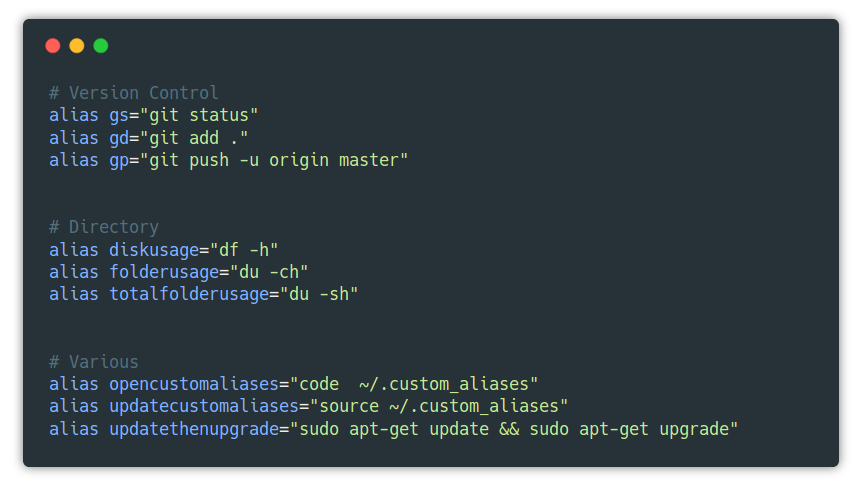

Для ввода данных класс Scanner из библиотеки пакетов Java.
класс импортировать в той программе, где он будет использоваться. до начала открытого класса в коде программы.

В классе методы для чтения очередного символа заданного типа со стандартного потока ввода, для проверки существования такого символа.

Для работы с потоком ввода создать объект класса Scanner, при создании указав, с каким потоком ввода он будет связан. Стандартный поток ввода (клавиатура) в Java представлен объектом — System.in.
стандартный поток вывода (дисплей) — объектом System.out. стандартный поток для вывода ошибок — System.err.
```java
import java.util.Scanner; // импортируем класс

public class Main {
    public static void main(String[] args) {
        Scanner sc = new Scanner(System.in); // создаём объект класса Scanner
        int i = 2;
        System.out.print("Введите целое число: ");
        if(sc.hasNextInt()) { // возвращает истину если с потока ввода можно считать целое число
          i = sc.nextInt(); // считывает целое число с потока ввода и сохраняем в переменную
          System.out.println(i*2);
        } else {
          System.out.println("Вы ввели не целое число");
        }
    }
}
```
hasNextDouble(), применённый объекту класса Scanner, можно ли считать с потока ввода вещественное число типа double, а метод nextDouble() — считывает его.

считать значение без предварительной проверки, во время исполнения программы можно получить ошибку (отладчик заранее такую ошибку не обнаружит). в представленной далее программе ввести какое-то вещественное число:
```java
import java.util.Scanner;
public class Main {
    public static void main(String[] args) {
        Scanner sc = new Scanner(System.in);
        double  i = sc.nextDouble(); // если ввести букву s, то случится ошибка во время исполнения
        System.out.println(i/3);
    }
}
```
nextLine(), считывать целую последовательность символов, строку, полученное через этот метод значение нужно сохранять в объекте класса String.
создаётся два таких объекта, потом в них поочерёдно записывается ввод пользователя, на экран выводится одна строка, полученная объединением введённых последовательностей символов.
```java
import java.util.Scanner;
public class Main {
    public static void main(String[] args) {
        Scanner sc = new Scanner(System.in);
        String s1, s2;
        s1 = sc.nextLine();
        s2 = sc.nextLine();
        System.out.println(s1 + s2);
    }
}
```
hasNext(), проверяющий остались ли в потоке ввода какие-то символы.

В классе String полезных методов, применять к строкам (перед именем метода указывать тип того значения, которое он возвращает):

int length() — возвращает длину строки (количество символов в ней);
boolean isEmpty() — проверяет, пустая ли строка;
String replace(a, b) — возвращает строку, где символ a (литерал или переменная типа char) заменён на символ b;
String toLowerCase() — возвращает строку, где все символы исходной строки преобразованы к строчным;
String toUpperCase() — возвращает строку, где все символы исходной строки преобразованы к прописным;
boolean equals(s) — возвращает истинну, если строка к которой применён метод, совпадает со строкой s указанной в аргументе метода (с помощью оператора == строки сравнивать нельзя, как и любые другие объекты);
int indexOf(ch) — возвращает индекс символа ch в строке (индекс это порядковый номер символа, но нумероваться символы начинают с нуля). Если символ совсем не будет найден, то возвратит -1. Если символ встречается в строке нескольо раз, то вовзвратит индекс его первого вхождения.
int lastIndexOf(ch) — аналогичен предыдущему методу, но возвращает индекс последнего вхождения, если смивол встретился в строке несколько раз.
int indexOf(ch,n) — возвращает индекс символа ch в строке, но начинает проверку с индекса n (индекс это порядковый номер символа, но нумероваться символы начинают с нуля).
char charAt(n) — возвращает код символа, находящегося в строке под индексом n (индекс это порядковый номер символа, но нумероваться символы начинают с нуля).
```java
public class Main {
    public static void main(String[] args) {
        String s1 = "firefox";
        System.out.println(s1.toUpperCase()); // выведет «FIREFOX»
        String s2 = s1.replace('o', 'a');
        System.out.println(s2); // выведет «firefax»
        System.out.println(s2.charAt(1)); // выведет «i»
        int i;
        i = s1.length();
        System.out.println(i); // выведет 7
        i = s1.indexOf('f');
        System.out.println(i); // выведет 0
        i = s1.indexOf('r');
        System.out.println(i); // выведет 2
        i = s1.lastIndexOf('f');
        System.out.println(i); // выведет 4
        i = s1.indexOf('t');
        System.out.println(i); // выведет -1
        i = s1.indexOf('r',3);
        System.out.println(i); // выведет -1
    }
}
```
выведет на экран индексы всех пробелов в строке, введенноё пользователем с клавиатуры:
```java
import java.util.Scanner;
public class Main {
    public static void main(String[] args) {
        Scanner sc = new Scanner(System.in);
        String s = sc.nextLine();
        for(int i=0; i < s.length(); i++) {
            if(s.charAt(i) == ' ') {
                System.out.println(i);
            }
        }
    }
}
```


Функция печати записывает данные в поток STDOUT (1) функцией write
ОС решает, куда вывести результат. По умолчанию на экран терминала

ЯП не взаимодействуют с железом, уметь писать в STDOUT, а дальше все сделает ОС. Программы могут только попросить ОС выполнить задачу.


перенаправление потоков.
вывод команды не выводить на экран, а записать в файл:
ls -la > output

> - перезаписывает файл, >> - добавляет. взять вывод из команды и отправить его в файл.


Кроме стандартного вывода, с каждым процессом ассоциируются два потока:

STDERR — вывод ошибок
STDIN (0) — стандартный ввод, через него программа может получать данные на вход.

wc (word count). считать количество слов, строк или символов в файле. Когда говорим о файле, в *nix-системах означает, что данные можно передать и в стандартный поток ввода:

# Флаг l считать количество строк
wc -l < result # Содержимое файла result отправляем в стандартный ввод команды wc

стрелка меняет направление и содержимое файла отправляется в поток STDIN запускаемой программы wc.

объединим перенаправление ввода и вывода:
wc -l < result > output # Содержимое файла result отправляем в стандартный ввод команды wc, а вывод направляем в файл output

отправить вывод на печать.



Поток STDERR (2) отделить вывод программы от ошибок.

Как и STDOUT, он выводит информацию на экран.

перенаправление вывода в файл перенаправляет только STDOUT.
отобразить содержимое несущ директории, команда ls выдаст ошибку:

ls lala > output # Направляем вывод команды ls в файл output

ls: cannot access 'lala': No such file or directory # Вывод на экран
Перенаправление есть, но сообщение вывелось на экран. STDERR остался привязан к экрану, а внутри файла output — пустота.

Перенаправление STDERR в STDOUT
за каждым потоком закреплен файловым дескриптором. доступ к потокам ввода и вывода.

перенаправить STDERR в STDOUT или отправить оба потока в файл.

стандартный поток ошибок объединяют со стандартным потоком вывода, обрабатывать ошибки и результат выполнения вместе:

# STDOUT перенаправляется в файл output, затем STDERR перенаправляется в STDOUT, запись в файл продолжается
ls lala > output 2>&1

ls: cannot access 'lala': No such file or directory # Содержимое файла output в окне терминала

& ставить, указать поток, в который осуществляется перенаправление.

2>&1 перед > output. не будет работать, интерпретатор прочитает 2>&1, еще не будет знать, куда перенаправлен стандартный поток вывода. потоки ошибок и вывода не будут объединены:

ls lala 2>&1 > output

ls: cannot access 'lala': No such file or directory # Вывод в окне терминала
Перенаправление потока STDERR само по себе, без вывода в файл:

#  STDERR просто перенаправляется в другой поток (STDOUT)
cd lala 2>&1

-bash: cd: lala: No such file or directory

Перенаправление потока в файл - указать номер перед >:

#  перенаправить STDERR в файл
cd lala 2> output

-bash: cd: lala: No such file or directory

Перенаправление обоих потоков в файл

# Оба потока (STDERR и STDOUT) перенаправляются в файл
cd lala &> output

-bash: cd: lala: No such file or directory


у одного процесса есть вход, а у другого — выход. При этом их можно подменять. Логично предположить, что их можно и соединить. Этот подход носит название пайплайн (от англ. pipeline). Именно пайплайнам мы уделим внимание в этом уроке.

Благодаря пайплайну можно соединять программы и протаскивать данные сквозь них. Получается цепочка функций, в которой каждое звено выступает в роли преобразователя или фильтра.

Когда мы учились грепать, то делали это по какому-то одному слову. Но часто возникает задача погрепать по нескольким словам. Не важно, как они расположены внутри строки, главное, что они встречаются там вместе.

Такую функциональность можно было бы сделать, усложнив саму программу grep. Но пайплайн позволяет добиться такого же поведения без необходимости писать сложную программу:

grep PATH .profile | grep local

PATH="$HOME/.local/bin:$PATH"
Обратите внимание на | — этот символ называется пайп. Он указывает, что командная оболочка должна взять поток STDOUT одного процесса и соединить его с потоком STDIN другого процесса.

Все утилиты, которые читают файлы, могут принимать данные через поток STDIN. Поскольку утилита grep принимает на вход и возвращает текст, то его можно комбинировать бесконечно:



Запись grep PATH .profile | grep local можно изменить, используя перенаправление. Так она станет проще для модификации:

cat .profile | grep PATH | grep local
В примере выше файл читается катом и отправляется в поток STDIN грепа.


cat source | grep Dog | uniq | sort
Посмотрим, как этот пример работает по шагам:

Читается файл source
Грепаются входные данные по подстроке Dog
Убираются дубли (в исходном файле две одинаковых строки Dog)
Сортируются входные данные и выводятся на экран
Пайплайн стал основой философии Unix, которая звучит так:

Пишите программы, которые делают что-то одно и делают это хорошо
Пишите программы, которые бы работали вместе
Пишите программы, которые бы поддерживали текстовые потоки, поскольку это универсальный интерфейс
Именно поэтому большинство утилит работают с сырым текстом — принимают его на вход и возвращают в поток STDOUT.

Такой подход позволяет получать сложное поведение из крайне простых составных блоков. Такая концепция называется стандартные интерфейсы и хорошо отражена в конструкторах Lego.


Файловую структуру можно не только просматривать, но и всячески модифицировать. В прошлом уроке мы научились создавать файлы через перенаправление потоков, а сейчас обсудим, как это делать напрямую.

Учтите, что возможность модифицировать файловую структуру завязана на правах пользователя. Если у вас нет соответствующих прав, вы получите ошибку доступа. Место, где вы гарантированно можете экспериментировать — ваша домашняя директория. Внутри нее все доступно на запись.

Для примеров этого урока мы создали каталог test в домашней директории. То есть все демонстрируемые команды выполняются в директории по адресу: ~/test.

Основные команды
Для создания файлов принято использовать утилиту touch. Основная задача этой утилиты — поменять время последнего доступа к файлу, но она обладает побочным эффектом.

Если файла не существует, то он будет создан — именно поэтому ее используют для создания файлов, хотя это не основное предназначение:

# В текущей директории создается пустой файл
touch empty-file


Удалить файл можно командой rm (сокращение от remove):

rm empty-file

В *nix-системах не существует понятия «переименовать файл». Переименование всегда равносильно перемещению, которое выполняется командой mv (move):

touch file
mv file renamed-file

Для копирования файлов и директорий используется утилита cp (copy).

У этой утилиты два аргумента:

Имя источника (откуда копируем)
Имя приемника (куда копируем)
Посмотрим, как эта утилита работает на практике:

cp renamed-file renamed-file-copy

Для копирования директории нужно добавить флаг -r (recursive).

Все эти и последующие утилиты работают с файлами и директориями, расположенными в любом месте файловой системы. Поэтому вы всегда можете передать любой путь: touch /tmp/tempfile.

Утилиты для работы с директориями частично отличаются. Создание директории выполняется командой mkdir (make directory):

mkdir my-dir

По умолчанию эта команда не создает вложенных директорий:

mkdir one/two/three
mkdir: cannot create directory ‘one/two/three’: No such file or directory

В такой ситуации придется создавать каждую директорию отдельно. Но есть и другой способ — воспользоваться флагом -p (--parents), который создает директории рекурсивно:

mkdir -p one/two/three

Удаление директорий выполняется той же командой, что и удаление файлов, но без флагов оно выдает предупреждение:

rm my-dir/
rm: cannot remove 'my-dir/': Is a directory

Чтобы не было ошибки, нужно добавить флаг -r (recursion). Он включает режим рекурсивного удаления содержимого директорий. Другими словами, идет просмотр содержимого во всех вложенных директориях и поддиректориях до самого конца:

rm -r my-dir

внутри директории содержатся файлы или директории с ограниченными правами доступа, например, доступные только для чтения. команда rm начнет задавать вопрос по каждому из них, нужно ли удалять файл.

Если вы точно уверены, что удалить нужно все, добавьте флаг -f (--force). Этот флаг позволяет игнорировать несуществующие файлы и не запрашивать подтверждение на удаление. rm удалит всю директорию без вопросов:

rm -rf one


cd без аргументов делает домашнюю директорию пользователя рабочей. Возникает вопрос, каким образом она узнает о том, где находится домашняя директория?

Можно предположить, что команда cd каким-то образом обращается к операционной системе и узнает у нее эту информацию или смотрит напрямую в конфигурационных файлах. Но ни первого, ни второго она не делает.

Эта команда ориентируется на так называемую переменную окружения, которую мы изучим в этом уроке.

Что такое переменные окружения
Переменные окружения похожи на переменные в языках программирования. Они существуют в рамках запущенной сессии командной оболочки, то есть, переменные пропадут, когда терминал закроется. Они подгружаются туда во время его инициализации, хотя это не единственный путь их появления.

Посмотреть установленные переменные можно командой env (environment). Ниже неполный список этих переменных, которые доступны на одном из серверов Хекслета:

env

TERM=xterm-256color
SHELL=/bin/bash
LC_ALL=en_US.UTF-8
USER=kirill.m
HEXLET_VERSION=v2711
PATH=/home/kirill.m/bin:/home/kirill.m/.local/bin:/usr/local/sbin:/usr/local/bin:/usr/sbin:/usr/bin:/sbin:/bin:/usr/games:/usr/local/games:/snap/bin
PWD=/home/kirill.m
LANG=en_US.UTF-8
SHLVL=1
HOME=/home/kirill.m
LOGNAME=kirill.m
Формат вывода очень простой: слева от знака равно расположено имя переменной, справа — значение. В вашем случае вывод команды env будет отличаться не только значениями этих переменных, но и их составом. Например, у вас точно не будет HEXLET_VERSION, но наверняка будет HOME, только с другим значением.

Основное предназначение переменных окружения — конфигурирование системы и программ. Их удобство заключается в универсальности. Кроме того, они помогают отвязать нас от способа появления этих значений в системе.

Возьмем для примера ту же команду cd. Она знает лишь то, что домашняя директория доступна в переменной окружения HOME. Как она попала в систему — не важно.

Без переменной окружения пришлось бы делать одну из двух вещей:

При вызове cd каждый раз указывать, где находится домашняя директория. Например, так: cd --home-dir /home/kirill.m. Такой способ убивает весь смысл быстрого перехода в домашнюю директорию
Договариваться, что где-то будет храниться специальный файл с настройками, в том числе домашней директории. Настройки из этого файла будут читаться командой cd при каждом запуске
Существует некоторый базовый набор переменных, которые всегда устанавливаются bash при старте. Они используются большим количеством утилит и нужны для нормального функционирования системы. Одну из таких переменных мы уже знаем — это HOME:

# Для вывода переменной используется echo,
# а перед самой переменной ставится знак $
echo $HOME

/home/kirill.m

# Вокруг знака `=` не должно быть пробелов
HOME=/tmp
echo $HOME

/tmp

# Возвращаем обратно
HOME=/home/kirill.m
echo $HOME

/home/kirill.m
Теперь проведем эксперимент: попробуем установить HOME и выполнить переход в эту директорию с помощью команды cd, которая должна отправить нас в домашнюю директорию:

# Достаточно выполнить присваивание слева от запускаемой команды
HOME=/tmp cd

/tmp

pwd

/tmp
Команда cd выполнила переход по пути, указанном в переменной HOME. Теперь снова сделаем cd, но не добавляя определение переменной слева:

cd
pwd

/home/kirill.m

echo $HOME

/home/kirill.m

переход в настоящую домашнюю директорию. вызов HOME=/tmp cd изменил переменную только для того конкретного запуска. задавать значение переменной окружения: локальный и глобальный.

HOME=/tmp перед cd, переменная не была изменена для текущей сессии — она была изменена для запущенной команды, в данном случае cd.

установки изменяет значение глобально, для всей сессии и выполняется так:

echo $HOME

/home/kirill.m

export HOME=/tmp
cd
pwd

/tmp

echo $HOME

/tmp

изменение происходит в рамках текущей сессии. открыто две вкладки терминала, то изменение произойдет только в той вкладке, в которой мы написали команду.


Определение переменной в Bash: с командой export и без

Bash-переменные Linux предполагают два способа определения переменной оболочки — с командой export и без нее. Это важный момент — добавление этой команды меняет область действия переменной. В этой статье разберем различия между определением переменной оболочки с export и без, а также рассмотрим варианты использования export и его параметры.

Bash — самый популярный командный интерпретатор в юниксоподобных системах, особенно в GNU/Linux. С другой — скриптовый язык программирования со своим синтаксисом и особенностями.

Определение переменной с export и без
Переменные Bash похожи на переменные в Java или C++, но с одним существенным отличием: они не нуждаются в объявлении. Переменную создает присвоение ее имени значения. Например, так:

MYVAR=1729
export MYVAR=1729
В первом случае создается переменная оболочки с именем MYVAR, которой присваивается значение 1729. Во втором определение переменной происходит точно также, но с помощью export. Эта команда отмечает переменную для экспорта во все дочерние процессы, которые созданы внутри оболочки и делают ее переменной окружения.

Основное различие между этими двумя способами определения переменной заключается в том, что export делает переменную доступной для всех следующих команд, которые выполняются в этой оболочке. Команда export помечает MYVAR для автоматического экспорта в среду дочерних процессов, которые создаются такими командами:

export MYVAR=1729
echo $MYVAR
1729
bash    # Open a new child shell
echo $MYVAR
1729
Если переменная задана без использования export, то она будет доступна только внутри оболочки. Другими словами, дочерние оболочки, процесс или команды вне ее не получат доступа к ней:

MYVAR=1729
echo $MYVAR
1729
bash    # Open a new child shell
echo $MYVAR
$
Отличия переменных в Bash от переменных в других языках программирования заключаются в следующем:

Переменные оболочки (определенные без экспорта) подобны локальным переменным. Доступ к ним можно получить только внутри этой оболочки.
Переменные окружения (определенные с помощью экспорта) подобны глобальным переменным. Доступ к ним могут получить как в родительской оболочке, так и во всех дочерних оболочках, процессах и командах.
Однако между глобальными переменными в Bash и других языках программирования существует важное различие. Родительская оболочка может экспортировать свои переменные в среду дочерней оболочки, но дочерняя оболочка не может экспортировать переменные обратно в родительскую.

Когда стоит использовать export, а когда — нет
Переменные окружения следует использовать в случае, когда нужно экспортировать переменные и сделать их доступными для следующих команд и процессов. Обычно это происходит, когда среду нужно использовать вместе с дочерними процессами, например:

При настройке среды дочернего процесса или оболочки
При определении переменной, которую будет использовать сценарий bash, выполняемый из родительской оболочки
При настройке переменных окружения для терминальных мультиплексоров (например, screen или tmux)
При настройке среды сборки для сценариев и инструментов сборки
Переменные оболочки стоит использовать в случаях, когда они должны существовать только в родительской оболочке. Например, к ним относятся:

Переменные счетчика циклов
Временные переменные
Как использовать export
Подробнее рассмотрим команду export и связанные с ней команды, которые часто используются с переменными окружения и оболочки.

Экспорт функции
export может экспортировать не только переменные, но и функции. Для этого нужно использовать опцию командной строки export -f. Стоит отметить, что функции будут доступны и в дочерних оболочках и процессах:

func(){
> echo hi
> }
func
hi
bash    # Open a new child shell
func
bash: func: command not found
exit   # Back to parent shell
export -f func
bash    # Open a new child shell
func
hi
Удаление переменной
Переменные окружения автоматически экспортируются во все дочерние оболочки, а также в их дочерние оболочки. Для удаления автоматически унаследованной переменной существует команда export -n:

echo $USER
ubuntu
bash    # Open a new child shell
echo $USER
ubuntu
exit   # Back to parent shell
export -n USER
bash    # Open a new child shell again
echo $USER
$
Список всех экспортированных переменных
Для получения списка всех переменных и функций, экспортированных в текущую оболочку, используется команда export -p:

export -p
declare -x COLORTERM="truecolor"
declare -x DESKTOP_SESSION="ubuntu"
declare -x DISPLAY=":0"
declare -x GDMSESSION="ubuntu"
declare -x LESSCHARSET="latin1"
declare -x LESSCLOSE="/usr/bin/lesspipe %s %s"
declare -x LESSOPEN="|/usr/bin/lesspipe.sh %s 2>&-"
.
.
declare -x XDG_SESSION_DESKTOP="ubuntu"
declare -x XDG_SESSION_ID="2"
declare -x XDG_SESSION_TYPE="x11"
declare -x XDG_VTNR="1"
Эта команда помогает проверить, что все переменные оболочки экспортированы правильно.

Автоматический экспорт всех переменных
Для автоматического экспорта всех переменных, определенных в текущей оболочке, существует опция all export. Ее можно включать или отключать, используя команду set:

set -a # Enable allexport using single letter syntax
set -o allexport # Enable using full option name syntax
set +a # Disable allexport using single letter syntax
set +o allexport # Disable using full option name syntax
set -a
MYVAR=1729    # no export
bash    # Open a new child shell
echo $MYVAR
1729
Эту команду полезно включать перед вызовом сценария Bash, который определяет множество переменных без команды экспорта.

Как связаны родительская и дочерние оболочки
У передачи переменной окружения между родительской и дочерними оболочками существует определенная иерархия:



Сценарии и export
При создании сценария, вызываемого из командной оболочки и содержащего команду export, нужно проверить соответствие результата экспорта ожидаемому. Для этого есть несколько способов.

Export во время выполнения скрипта
Выполнение сценария с командой export из командной оболочки происходит в дочерней оболочке. Это означает, что любые переменные, экспортируемые сценарием, будут доступны только его дочерним оболочкам, но не родительской. Когда выполнение сценария завершится, экспортированные переменные исчезнут из среды:

echo "export MYVAR=1729" > myscript.sh
chmod +x myscript.sh
./myscript.sh
echo $MYVAR
$

Экспорт переменной в родительскую оболочку
Если при выполнении сценария необходимо экспортировать переменную окружения в родительскую оболочку, можно использовать команду source. Она позволяет выполнить сценарий в текущей среде без создания дочерней оболочки.

echo "MYVAR=1729" > myscript.sh
source myscript.sh
echo $MYVAR
1729

Команда export помогает экспортировать переменные окружения так, чтобы они были доступны во всех дочерних процессах, оболочках и командах. Кроме того, различные параметры командной строки export и других связанных команд предоставляют различные способы определения, экспорта и использования переменных в разных оболочках и сценариях.


История команд bash хранится в специальном файле .bash_history, который лежит в домашней директории пользователя. Каждый раз, когда пользователь вводит команду, она попадает именно в этот файл. Запись происходит при завершении сеанса. Этот файл ничем не отличается от остальных файлов: его можно открыть, посмотреть и даже отредактировать. За то, какое количество команд хранится в истории, отвечает переменная окружения HISTFILESIZE. Если она выставлена, то берется указанное в ней число. Если переменной нет, история не обрезается и файл .bash_history растет бесконечно:

tail .bash_history

rm -r one/
env
HOME=/tmp cd
pwd
cd
echo $HOME
export HOME=/tmp
id
exit
id

Посмотреть историю можно и более простым способом. Достаточно выполнить команду history:

history

 1  docke rps
 2  free -m
 3  docker ps
 4  docker exec -it 8678a6520641 bash
 5  ls
 6  exit
 7  docker ps
 8  docker exec -it 1209b6e5ce6b bash
 ...

 Эта команда выведет содержимое файла .bash_history, добавив слева номер. Если набрать history 5, то отобразятся только пять последних введенных команд. Используя номер команды в выводе history, можно выполнить повторный запуск без необходимости набирать или копировать команду из истории:

# команда имела второй номер в списке выше
!2

free -m
              total        used        free      shared  buff/cache   available
Mem:           1998        1532          75          21         390         227
Swap:             0           0           0

При необходимости историю всегда можно погрепать:

history | grep export

 174  export HOME=/tmp
 183  history | grep export

реверсивный поиск. Ctrl + r, запустится поиск по истории. Он ожидает ввода символов и сразу отображает ближайшую команду, в которой эти символы встречаются. Если найденное соответствие вас не устроило, то повторное нажатие Ctrl + r выберет следующее соответствие из истории:


Взаимодействие с операционной системой всегда ведется от какого-то конкретного пользователя, созданного в системе. В этом уроке мы изучим концепцию пользователей и групп. Эта тема нужна, чтобы лучше понять права пользователей, которые мы будем обсуждать далее в курсе.

Тема пользователей и их прав в системе в первую очередь относится к функционированию самой операционной системы. Оболочка лишь предоставляет утилиты, позволяющие анализировать доступы и изменять их.

Команда whoami позволяет выяснить имя пользователя:

whoami

kirill.m
Права пользователей
Абсолютно любой процесс, запускаемый в операционной системе, стартует от имени некоторого пользователя. Соответственно, его возможности по влиянию на файловую систему ограничены правами пользователя, от имени которого процесс запущен.

Обратите внимание, что мы говорим не «пользователь запустил процесс», а «процесс запускается от имени пользователя». Дело в том, что присутствие пользователя для запуска необязательно. Работая в командной строке, мы запускаем все сами. Но когда система загружается, то она запускает множество различных процессов автоматически.

Для многих процессов в системе создаются собственные пользователи с ограниченным набором прав.

Команда ps (process status) выводит отчет о работающих процессах. Информацию о том, какой процесс и под каким пользователем запущен, можно получить из вывода ps aux:

ps aux

# Левый столбец — имя пользователя
root      7717  0.0  0.0   4244  1504 ?        S    10:52   0:00 mpstat 1 3
kirill.m  7718  0.0  0.1  36084  3236 pts/0    R+   10:52   0:00 ps aux
alexand+ 10542  0.0  0.1  21500  2892 pts/1    Ss+  10:10   0:00 -bash
root     11113  0.0  0.1  92796  2596 ?        Ss   08:50   0:00 sshd: kirill.m [priv]
kirill.m 11116  0.0  0.0  45276  1408 ?        Ss   08:50   0:00 /lib/systemd/systemd --user
kirill.m 11119  0.0  0.0  61148  1860 ?        S    08:50   0:00 (sd-pam)
kirill.m 11194  0.0  0.0  92796  1800 ?        S    08:50   0:00 sshd: kirill.m@pts/0
kirill.m 11195  0.0  0.2  21388  4448 pts/0    Ss   08:50   0:00 -bash
root     12195  0.0  0.0      0     0 ?        S    10:13   0:00 [kworker/u30:1]
root     12880  0.0  0.1  92796  2748 ?        Ss   08:55   0:00 sshd: alexander.v [priv]
alexand+ 12883  0.0  0.0  45276  1924 ?        Ss   08:55   0:00 /lib/systemd/systemd --user
alexand+ 12884  0.0  0.0  61148  1860 ?        S    08:55   0:00 (sd-pam)
alexand+ 12920  0.0  0.1  92796  2420 ?        S    08:55   0:00 sshd: alexander.v@pts/1,pts/2

Взаимодействие с файловой системой происходит через запуск тех или иных утилит, которые модифицируют, создают или анализируют файловую структуру.

запускаем утилиту touch. Мы от своего имени стартуем процесс, внутри которого запускается программа touch. Эта программа создает файл и делает вас владельцем нового файла.

Кстати, модификация существующих файлов не влияет на владельца — для его смены нужно воспользоваться специальной утилитой. В домашней директории пользователя все принадлежит пользователю:

ls -la

total 44
drwxr-xr-x 5 kirill.m kirill.m 4096 Aug 29 11:34 .
drwxr-xr-x 8 root     root     4096 Apr 26 10:38 ..
-rw------- 1 kirill.m kirill.m 2540 Aug 30 07:26 .bash_history
-rw-r--r-- 1 kirill.m kirill.m  220 Aug 31  2015 .bash_logout
-rw-r--r-- 1 kirill.m kirill.m 3771 Aug 31  2015 .bashrc
drwx------ 2 kirill.m kirill.m 4096 Mar 30 18:10 .cache
-rw------- 1 kirill.m kirill.m   55 Aug 28 18:49 .lesshst
drwxrwxr-x 2 kirill.m kirill.m 4096 Aug 29 08:35 .nano
-rw-r--r-- 1 kirill.m kirill.m  655 May 16  2017 .profile
-rw-rw-r-- 1 kirill.m kirill.m    0 Aug 29 11:27 renamed-file
drwx------ 2 kirill.m kirill.m 4096 Jan 22  2018 .ssh
-rw------- 1 kirill.m kirill.m  513 Aug 29 08:06 .viminfo
Третий столбец в этом выводе — как раз владелец. Единственная запись, которая выбивается из всего списка — это .., то есть родительская директория.

Ее владельцем является пользователь root, о котором мы позже поговорим. Если хорошо подумать, то это логично, ведь директория /home не является собственностью пользователей системы:

ls -la /home/

total 32
drwxr-xr-x  8 root              root              4096 Apr 26 10:38 .
drwxr-xr-x 23 root              root              4096 Aug 27 06:53 ..
drwxr-xr-x  5 alexander.v       alexander.v       4096 Jan 22  2018 alexander.v
drwxr-xr-x  5 kirill.m          kirill.m          4096 Aug 29 11:34 kirill.m
drwxr-xr-x  4 rakhim            rakhim            4096 Apr 26 10:05 rakhim
drwxr-xr-x  4 rakhim.d          rakhim.d          4096 Apr 26 10:41 rakhim.d
Каждый каталог в директории /home — это домашний каталог конкретного пользователя. Поэтому они все имеют разных владельцев, как правило, совпадающих с именем директории.

Имя пользователя в системе должно быть уникальным, но его можно менять. Если посмотреть под капот этой системы, то мы увидим, что имя пользователя связано с идентификатором, называемым UID. Это число, которое и определяет пользователя.

Если поменяется имя пользователя, но идентификатор UID останется прежним, то все доступы останутся. Если сменится идентификатор, то фактически сменится и пользователь. Соответственно, новый пользователь потеряет доступы к старому аккаунту.

Посмотреть свой идентификатор можно разными способами. Первый способ — с помощью команды id:

id

uid=1002(kirill.m) gid=1002(kirill.m) groups=1002(kirill.m),999(docker)
Второй способ связан с просмотром одного важного файла, который выступает основным хранилищем пользователей в *nix-системах. Да, это обычный текстовый файл, как и все остальное:

cat /etc/passwd

root:x:0:0:root:/root:/bin/bash
daemon:x:1:1:daemon:/usr/sbin:/usr/sbin/nologin
bin:x:2:2:bin:/bin:/usr/sbin/nologin
sys:x:3:3:sys:/dev:/usr/sbin/nologin
sync:x:4:65534:sync:/bin:/bin/sync
games:x:5:60:games:/usr/games:/usr/sbin/nologin
man:x:6:12:man:/var/cache/man:/usr/sbin/nologin
lp:x:7:7:lp:/var/spool/lpd:/usr/sbin/nologin
mail:x:8:8:mail:/var/mail:/usr/sbin/nologin
news:x:9:9:news:/var/spool/news:/usr/sbin/nologin
uucp:x:10:10:uucp:/var/spool/uucp:/usr/sbin/nologin
proxy:x:13:13:proxy:/bin:/usr/sbin/nologin
www-data:x:33:33:www-data:/var/www:/usr/sbin/nologin
kirill.m:x:1002:1002::/home/kirill.m:/bin/bash



Кроме имени и идентификатора, здесь указана командная оболочка по умолчанию и домашняя директория пользователя, которую можно поменять. Запись /usr/sbin/nologin говорит, что пользователь не может входить в систему. Такие пользователи нужны для запуска программ, у которых ограниченные права — естественно, входить в систему им не нужно.

Права групп пользователей
Кроме имени, у пользователей *nix-систем есть связанное с ним понятие — группа. Она создана для группового доступа к разделяемому (общему) ресурсу — например, файлу.

группа разработчиков, которые регулярно заходят на сервер. Им нужно дать одинаковые возможности по управлению определенными файлами. Владелец у файла ровно один, поэтому мы не можем решить этот вопрос через смену владельца. Для этого нужно создать группу и привязать ее к самому пользователю.

Группы, ассоциированные с текущим пользователем, показываются в выводе команды id:

id

uid=1002(kirill.m) gid=1002(kirill.m) groups=1002(kirill.m),999(docker)
Здесь группа kirill.m считается основной — такая группа может быть только одна, и именно в нее входят любые создаваемые файлы от имени текущего пользователя. Кроме основной, пользователь может входить в произвольное число дополнительных групп. То, как это влияет на доступы, мы рассмотрим в одном из следующих уроков.

В *nix-системе присутствует специальный пользователь — root или суперпользователь. Главная его особенность — это идентификатор со значением 0. Этот пользователь имеет особое значение и может выполнять абсолютно любые действия в системе. У пользователя root в файле /etc/passwd будет вот такая запись:



не рекомендуем использовать root на регулярной основе, и ни в коем случае не входить под ним в систему. Суперпользователь — прямой доступ ко всему и большая дыра в безопасности системы. через него систему очень легко убить: удалить не тот файл или испортить важную конфигурацию, после чего вход в систему станет невозможным.

root для выполнения некоторых привилегированных действий, которые недоступны обычным пользователям.


В работе с командной строкой мы часто сталкиваемся с ситуациями, в которых необходимо повышать привилегии и выполнять команды от имени суперпользователя root. С некоторыми мы уже столкнулись, с другими познакомимся в следующих уроках:

Установка новых программ
Навигация по чужим директориям
Изменение прав доступа
Изменение содержимого в файлах, не принадлежащих текущему пользователю
Создание, редактирование и удаление файлов, когда не хватает прав текущего пользователя
Запуск программ, требующих повышенных привилегий
В этом уроке обсудим, как стать другим пользователем. Для этого зайдите в систему и воспользуйтесь утилитой su (сокращение от substitute user или switch user). Когда-то такой способ был основным, но сейчас он устарел и не рекомендуется к использованию. Подробнее об этом можно прочитать в статье «Su или sudo?» из дополнительных материалов.

Основной способ повышать привилегии в современных системах — утилита sudo (substitute user and do — дословно «подменить пользователя и выполнить»).

Использовать sudo очень просто, достаточно написать эту команду слева от любой другой и выполнить. По умолчанию она пытается повысить привилегии до суперпользователя:

# Нет прав на выполнение
touch /etc/myfile

touch: cannot touch '/etc/myfile': Permission denied

# С `sudo` все работает
sudo touch /etc/myfile

# Видно, что владелец файла — это суперпользователь `root`
stat /etc/myfile

  File: '/etc/myfile'
  Size: 0           Blocks: 0          IO Block: 4096   regular empty file
Device: ca01h/51713d    Inode: 2761        Links: 1
Access: (0644/-rw-r--r--)  Uid: (    0/    root)   Gid: (    0/    root)

# Нет прав на удаление
rm /etc/myfile

rm: remove write-protected regular empty file '/etc/myfile'? y
rm: cannot remove '/etc/myfile': Permission denied

# Опять помогла утилита `sudo`
sudo rm /etc/myfile
В зависимости от настроек, утилита sudo попросит ваш пароль для входа или вообще откажется работать, сказав, что у вас нет права ее использовать. Как правило, в Ubuntu sudo спрашивает пароль и запоминает его на пять минут. На протяжении этого времени вы можете использовать sudo, не вводя пароль каждый раз.

Иногда нужно выполнить команду из-под пользователя, отличного от root. Тогда придется добавить флаг -u:

sudo -u nobody mkdir /tmp/test
# Директория создана от имени пользователя nobody
stat /tmp/test

  File: '/tmp/test'
  Size: 4096        Blocks: 8          IO Block: 4096   directory
Device: ca01h/51713d    Inode: 4577        Links: 2
Access: (0755/drwxr-xr-x)  Uid: (65534/  nobody)   Gid: (65534/ nogroup)
Если нужно произвести сразу пачку действий от имени другого пользователя, можно запустить новую оболочку внутри текущей. Другими словами, мы стартуем новую сессию:

# Команда `sudo` запросит пароль текущего пользователя
sudo -i

# Проверяем, что сессия запущена от суперпользователя
id

uid=0(root) gid=0(root) groups=0(root)
Главное — не забыть переключиться обратно после завершения необходимых манипуляций. Для этого наберите exit.

Знание про sudo играет с новичками злую шутку. Каждый раз, когда они видят странные ошибки, то не пытаются разобраться, а пробуют запустить команду с sudo без параметров — выполнить ее от суперпользователя. создает еще больше проблем.

из-под sudo мы запустили команду, которая создает файлы и директории. владельцем этих файлов становится суперпользователь. Все последующие обращения к этому файлу без sudo начнут выдавать ошибку «У вас нет прав доступа». необязательно работать с этими файлами напрямую. Множество программ так или иначе обращаются к файловой системе для чтения конфигурационных и других файлов.

В некоторых случаях sudo – это то, что нужно. В других случаях требуется изменить права (об этом в следующем уроке), а иногда и переустановить какую-нибудь часть системы.

Все, что лежит в личных директориях пользователя, должно принадлежать этому пользователю
Все, что находится вне домашней директории пользователя и требует дополнительных прав, скорее должно запускаться с sudo, но бывают и исключения
Рассмотрим, как это работает на практике:

ls -la

# Все содержимое домашней директории принадлежит одному пользователю
# Сама директория пользователя принадлежит ему же
# Родительская директория принадлежит суперпользователю
drwxr-xr-x+ 117 mokevnin  staff    3744 Feb 19 15:55 .
drwxr-xr-x    5 root      admin     160 Oct 12 19:15 ..
-r--------    1 mokevnin  staff       7 Nov 21  2017 .CFUserTextEncoding
-rw-r--r--@   1 mokevnin  staff   22532 Feb  8 00:04 .DS_Store


touch /etc/myfile

touch: cannot touch '/etc/myfile': Permission denied
Она указывает, что текущий пользователь не имеет прав на создание файлов в каталоге /etc. Почему? Все дело в правах доступа, которые мы изучим в этом уроке.

Кроме имени пользователя и группы, с каждым файлом ассоциированы права доступа:

r — чтение (read)
w — запись (write)
x — исполнение (execute)
Причем эти права задаются для трех типов пользователей:

Владельца (User)
Пользователей, входящих в ту же группу (Group)
Остальных (Other) — тех, кто не попал в предыдущие две
Разберем на примере:

# Пример строчки из вывода команды ls -la
-rw-r--r-- 1 kirill.m kirill.m 3771 Aug 31  2015 .profile
Запись слева представляет собой один из вариантов описания прав доступа (permissions). Для удобства чтения разделим эту запись на группы символов:

- — этот символ обозначает, что перед нами файл
rw- — права первого типа (для владельца файла). Владелец может читать этот файл (r) и писать в него (w). Прочерк в конце означает, что этот файл нельзя исполнять
r-- — права второго типа (для группы владельца). В нашем случае такие права есть у тех, кто входит в группу kirill.m. Запись r-- говорит о наличии доступа только для чтения, а изменение и исполнение запрещены.
r-- — права третьей группы (все остальные). В нашем случае права совпадают со второй группой, поэтому файл доступен только для чтения
Не важно, какой файл или директорию мы смотрим — порядок прав в этой группе всегда один и тот же — чтение-запись-исполнение, а прочерк означает отсутствие этого права:



А кто может удалить этот файл? Для ответа на этот вопрос важно знать владельца, группу и права той директории, в которой лежит файл .profile. Сам файл не может обозначить прав на свое удаление, потому что права всегда берутся из той директории, в которой файл находится.

Удалить файл можно, только если у вас есть возможность писать в эту директорию:

ls -la /home/ | grep kirill

drwxr-xr-x  5 kirill.m          kirill.m          4096 Aug 29 11:34 kirill.m

Домашняя директория имеет другие права:

В самом начале вместо - стоит d, которая обозначает директорию
Права для владельца — rwx, а для всех остальных — r-x. Из этого описания видно, что только пользователь может писать внутрь своей домашней директории
Что такое x в отношении директорий? Это право позволяет перемещаться в директорию и обращаться ко всем расположенным в ней файлам и каталогам. Обращаться можно при условии, что эти файлы доступны на чтение, запись или выполнение. Например, если положить доступный на чтение файл в директорию с правом x, то вы сможете прочитать этот файл. Если убрать с этой директории право x, то вы лишитесь доступа к файлу.

Но что тогда такое чтение? Здесь все более интуитивно понятно. По сути, директория — это список файлов, поэтому право на чтение позволяет прочитать этот список, а именно вывести список имен файлов, содержащихся в директории.

Но представим, что вы хотите посмотреть не простой список имен файлов, а список с дополнительной информацией — как при выводе ls -l. Тогда потребуется еще и право x, потому что в этом случае надо обращаться к файлам за их метаданными (владелец, группа, дата изменения, права и др.). без права r вы не сможете посмотреть содержимое директории.

A	B	C	D
#	Permission	rwx	Binary
7	read, write and execute	rwx	111
6	read and write	rw-	110
5	read and execute	r-x	101
4	read only	r--	100
3	write and execute	-wx	011
2	write only	-w-	010
1	execute only	--x	001

перевести несколько примеров из буквенной формы в числовую:

drwxr-xr-x соответствует 755
-rw-r--r-- соответствует 644

пользователь root находится вне этой системы. Для него не имеет никакого значения наличие любых прав — суперпользователь может все.

Для изменения владельца файлов или директорий можно использовать утилиту chown (от англ. change owner). В самом простом использовании команда принимает имя пользователя и файл (или директорию) для которого нужно сменить пользователя:

chown kirill .profile
Для изменения прав доступа к файлам и директориям можно использовать утилиту chmod (от англ. change mode). Утилита принимает права доступа и путь к файлу. Права доступа можно записывать обоими способами. С помощью знаков + и - права добавляются или удаляются соответственно:

chmod +r file.txt
chmod 754 file.txt


Привычный способ ставить программы для Windows-пользователя — бродить по интернету в поисках нужных приложений. В *nix-системах такой способ используется значительно реже. Для установки программ придумали пакетные менеджеры, с которыми мы познакомимся в этом уроке.

В некоторых операционных системах есть пакетный менеджер по умолчанию, в других его надо устанавливать самостоятельно. Например, для macOS есть пакетный менеджер brew.

Далее, для всех примеров будет использоваться пакетный менеджер apt, который поставляется с Ubuntu. Например, установка PHP в Ubuntu выглядит так:

# Требует sudo, потому что мы устанавливаем в системную директорию
sudo apt install php
# Здесь будет много текста и вопрос, устанавливать ли? Если да, то  PHP установится

php -v

PHP 7.4.3 (cli) (built: Feb 20 2020 08:51:50) ( NTS )
Пакетный менеджер состоит из нескольких частей. Одна из них взаимодействует с пользователем напрямую — это консольная утилита apt. Для установки нужно набрать apt install и далее указать имя необходимой программы.

Почти всегда пакетные менеджеры требуют запуска от суперпользователя root, потому что установка программ происходит в системные директории, недоступные для записи обычному пользователю:

apt install php

E: Could not open lock file /var/lib/dpkg/lock - open (13: Permission denied)
E: Unable to lock the administration directory (/var/lib/dpkg/), are you root?
Но это не всегда так — например, в macOS не нужно использовать sudo.

Установленные пакеты можно удалять. Для этого используется команда apt remove:

apt remove php
# Тут тоже много вывода и вопрос, удалять ли?
На другом конце провода находится каталог пакетов. Во время попытки установить программу утилита apt выполняет запрос в каталог и пытается понять, есть ли там пакет с таким именем. Если его нет, то вы об этом узнаете:

# Пакета wrongname не существует
sudo apt install wrongname

Reading package lists... Done
Building dependency tree
Reading state information... Done
E: Unable to locate package wrongname
Для экономии ресурсов и ускорения работы пакетный менеджер apt сохраняет индекс — список пакетов в каталоге. Индекс хранится на локальном диске и используется для работы пакетного менеджера.

Иногда это может приводить к ситуациям, что пакет в реальности существует, но apt утверждает обратное. Если вы чувствуете подвох, то запустите ручное обновление локального индекса:

sudo apt update
# Теперь можно устанавливать
sudo apt install php
Здесь у вас может возникнуть как минимум три вопроса:

Как узнать, какой пакет ставить?

Когда нам нужно установить определенную программу, то самый очевидный способ сделать это — найти сайт программы и выполнить действия, указанные на странице «Скачать» (Download). Обычно на этой странице написаны инструкции по пакетному менеджеру и примеры команд. К примеру, такое описание есть у Node.js.

Другой способ: загуглить php install ubuntu. Вы найдете статьи с такими же инструкциями. Со временем вы запомните имена многих пакетов и сможете ставить их без инструкций.

пакет — упаковка для программы. программа ничего не знает о существовании своего пакета и пакетного менеджера. пользователи могли установить программу через менеджер пакетов, ее разработчик заранее упаковывает программу в пакет.

В Ubuntu специальный формат пакетов, называемый deb. У этого формата есть подробная документация о том, как производить упаковку.

Как программы попадают в каталог?

Все сильно зависит от политики тех, кто поддерживает работу каталога. В некоторые каталоги попасть очень тяжело. Разработчики добавляют туда только проверенный софт, поэтому программы в них обновляют медленно. В других каталогах все происходит просто и быстро.

пройти некую процедуру, чтобы добавить программу в каталог. Это один из ключевых аспектов, по которому дистрибутивы Linux отличаются друг от друга. каталоги огромны, в них входят десятки и сотни тысяч программ и библиотек.

Пакетные менеджеры есть не только в операционных системах. экосистема, внутри которой возможно распространение библиотек или программ, имеет свой пакетный менеджер.
В Node.js — пакетный менеджер npm
в PHP — Composer


Запуск программ в командной строке активирует целый механизм по поиску и выполнению этой программы. Очень важно понимать, как он работает, так как проблемы с запуском вновь установленных программ возникают регулярно у всех разработчиков. Изучив материал этого урока, вы сможете решать проблемы с исполнением файлов.

Программа, независимо от того, что она делает — это всего лишь файл или набор файлов на диске. Один из этих файлов обязательно должен быть исполняемым. Помните тот самый x из урока про права доступа? Так вот, выполнить программу можно, только если она исполняемая, иначе попытка запустить ее приведет к ошибке.

Весь механизм по запуску программ в *nix-системах основан на соглашениях. Когда мы вводим некоторую команду, например, ls, командная оболочка начинает поиск исполняемого файла с именем ls в списке директорий, указанном в переменной окружения PATH:

echo $PATH

/home/hex/.local/bin:/home/hex/bin/:/home/hex/.local/bin:/usr/local/sbin:/usr/local/bin:/usr/sbin:/usr/bin:/sbin:/bin

Директории друг от друга отделяются двоеточием. В этом списке присутствуют как общесистемные пути, так и специфичные пути для конкретного пользователя. В вашем случае PATH будет другой.

Поиск программы выглядит следующим образом: командная оболочка перебирает директории слева направо и ищет директорию с файлом ls, доступным для исполнения. Если такого файла не оказалось, то выводится ошибка:

wrongname

bash: wrongname: command not found

Если файл с одним и тем же именем находится одновременно в нескольких директориях, то в первую очередь мы найдем файл в директории, расположенной левее.

Если вам интересно узнать, а где лежит исполняемый файл конкретной программы, то можно воспользоваться командой type (а еще which и whereis):

type cp

cp is /bin/cp

whereis cp

cp: /bin/cp /usr/share/man/man1/cp.1

which cp

/bin/cp

ls -al /bin | grep cp

-rwxr-xr-x 1 root root  141528 Jan 18  2018 cp

файл cp принадлежит суперпользователю, но исполнять его могут все.

Скорее всего, вы заметили, что почти все пути к исполняемым файлам программ оканчиваются на директории bin. По общему соглашению исполняемые файлы в таких директориях называют бинарниками. Пакетные менеджеры знают о бинарниках и во время установки программ переносят их в одну из директорий, входящих в переменную PATH. Для вновь устанавливаемых программ это обычно /usr/local/bin.

Иногда возникает необходимость расширить PATH. Особенно часто так происходит, когда мы устанавливаем программу через пакетные менеджеры языков программирования. Делать это надо осторожно — убедившись в том, что по-другому нельзя.

В некоторых ситуациях программа, которую вы хотите запустить, не лежит по путям поиска, прописанным в PATH. Более того, она и не должна там оказаться. Представим, что исполняемый файл программы находится прямо в текущей директории. Логично предположить, что мы можем набрать имя файла и запустить его, и программа выполнится. На самом деле этого не произойдет.

Такое поведение сделано в целях безопасности: возможно, вы хотели запустить какую-то стандартную программу, а злоумышленник положил в текущую директорию вредоносную программу с таким же именем. По этой причине, прямой запуск программ всегда должен быть путем до файла — например, path/to/executable/file. А если файл лежит в текущей директории? Здесь нам поможет обращение через точку ./:

pwd

/home/hex

cd test/
ls -al

total 16
drwxr-xr-x 2 hex hex 4096 Sep 10 15:24 .
drwxr-xr-x 1 hex hex 4096 Sep 10 15:24 ..
-rwxr-xr-x 1 hex hex   60 Sep 10 15:24 executable

executable

bash: executable: command not found

./executable

Hello from executable!

Из домашней директории переходим в директорию test.
Находим в директории test исполняемый файл executable, который при запуске выводит сообщение Hello from executable!.
Пытаемся запустить по имени файл executable и получаем ошибку.
Пробуем запустить через точку и получаем успешный запуск.
Изменение переменной PATH
В общем случае мы не рекомендуем менять переменную PATH самостоятельно. При правильной установке большинство программ самостоятельно добавляют свои исполняемые файлы в нужные места. В некоторых случаях они просят об этом пользователя — дают подсказки, какие файлы и куда нужно добавить после установки.

Чтобы вручную изменить переменную PATH, нужно поправить один из конфигурационных файлов Bash. Эти файлы лежат в домашней директории пользователя и могут называться так:

.bashrc.
.bash_profile.
.profile.
В зависимости от настроек терминала, Bash загружает либо одни файлы, либо другие. Если в вашей домашней директории есть файл .bashrc, то попробуйте использовать его. Если нет, пробуйте остальные файлы в том порядке, в котором они приведены выше. Добавьте в этот файл следующую строку:

export PATH=$PATH:/path/to/directory
В этой строке вам нужно заменить /path/to/directory на путь до директории с исполняемыми файлами. После этих манипуляций не забудьте перезапустить терминал.

Если вы используете оболочку Zsh (например, на MacOS), то вместо .bashrc используется файл .zshrc. Чтобы изменить значение переменной PATH в Zsh, откройте файл ~/.zshrc и добавьте ту же самую строку


Как использовать коды завершения в Bash-скриптах

Инструменты автоматизации и мониторинга удобны тем, что разработчик может взять готовые скрипты, при необходимости адаптировать и использовать в своём проекте. Можно заметить, что в некоторых скриптах используются коды завершения (exit codes), а в других нет. О коде завершения легко забыть, но это очень полезный инструмент. Особенно важно использовать его в скриптах командной строки.

В Linux и других Unix-подобных операционных системах программы во время завершения могут передавать значение родительскому процессу. Это значение называется кодом завершения или состоянием завершения. В POSIX по соглашению действует стандарт: программа передаёт 0 при успешном исполнении и 1 или большее число при неудачном исполнении.

Если смотреть на коды завершения в контексте скриптов для командной строки, ответ очевиден. Любой полезный Bash-скрипт неизбежно будет использоваться в других скриптах или его обернут в однострочник Bash. Это особенно актуально при использовании инструментов автоматизации типа SaltStack или инструментов мониторинга типа Nagios. Эти программы исполняют скрипт и проверяют статус завершения, чтобы определить, было ли исполнение успешным.

Кроме того, даже если вы не определяете коды завершения, они всё равно есть в ваших скриптах. Но без корректного определения кодов выхода можно столкнуться с проблемами: ложными сообщениями об успешном исполнении, которые могут повлиять на работу скрипта.

Что происходит, когда коды завершения не определены
В Linux любой код, запущенный в командной строке, имеет код завершения. Если код завершения не определён, Bash-скрипты используют код выхода последней запущенной команды. Чтобы лучше понять суть, обратите внимание на пример.

#!/bin/bash
touch /root/test
echo created file
Этот скрипт запускает команды touch и echo. Если запустить этот скрипт без прав суперпользователя, команда touch не выполнится. В этот момент мы хотели бы получить информацию об ошибке с помощью соответствующего кода завершения. Чтобы проверить код выхода, достаточно ввести в командную строку специальную переменную $?. Она печатает код возврата последней запущенной команды.

$ ./tmp.sh
touch: cannot touch '/root/test': Permission denied
created file
$ echo $?
0
Как видно, после запуска команды ./tmp.sh получаем код завершения 0. Этот код говорит об успешном выполнении команды, хотя на самом деле команда не выполнилась. Скрипт из примера выше исполняет две команды: touch и echo. Поскольку код завершения не определён, получаем код выхода последней запущенной команды. Это команда echo, которая успешно выполнилась.

Скрипт:

#!/bin/bash
touch /root/test
Если убрать из скрипта команду echo, можно получить код завершения команды touch.

$ ./tmp.sh
touch: cannot touch '/root/test': Permission denied
$ echo $?
1
Поскольку touch в данном случае — последняя запущенная команда, и она не выполнилась, получаем код возврата 1.

Как использовать коды завершения в Bash-скриптах
Удаление из скрипта команды echo позволило нам получить код завершения. Что делать, если нужно сделать разные действия в случае успешного и неуспешного выполнения команды touch? Речь идёт о печати stdout в случае успеха и stderr в случае неуспеха.

Проверяем коды завершения
Выше мы пользовались специальной переменной $?, чтобы получить код завершения скрипта. Также с помощью этой переменной можно проверить, выполнилась ли команда touch успешно.

#!/bin/bash
touch /root/test 2> /dev/null
if [ $? -eq 0 ]
then
  echo "Successfully created file"
else
  echo "Could not create file" >&2
fi
После рефакторинга скрипта получаем такое поведение:

Если команда touch выполняется с кодом 0, скрипт с помощью echo сообщает об успешно созданном файле.
Если команда touch выполняется с другим кодом, скрипт сообщает, что не смог создать файл.
Любой код завершения кроме 0 значит неудачную попытку создать файл. Скрипт с помощью echo отправляет сообщение о неудаче в stderr.

Выполнение:

$ ./tmp.sh
Could not create file
Создаём собственный код завершения
Наш скрипт уже сообщает об ошибке, если команда touch выполняется с ошибкой. Но в случае успешного выполнения команды мы всё также получаем код 0.

$ ./tmp.sh
Could not create file
$ echo $?
0
Поскольку скрипт завершился с ошибкой, было бы не очень хорошей идеей передавать код успешного завершения в другую программу, которая использует этот скрипт. Чтобы добавить собственный код завершения, можно воспользоваться командой exit.

#!/bin/bash
touch /root/test 2> /dev/null
if [ $? -eq 0 ]
then
  echo "Successfully created file"
  exit 0
else
  echo "Could not create file" >&2
  exit 1
fi
Теперь в случае успешного выполнения команды touch скрипт с помощью echo сообщает об успехе и завершается с кодом 0. В противном случае скрипт печатает сообщение об ошибке при попытке создать файл и завершается с кодом 1.

Выполнение:

$ ./tmp.sh
Could not create file
$ echo $?
1
Как использовать коды завершения в командной строке
Скрипт уже умеет сообщать пользователям и программам об успешном или неуспешном выполнении. Теперь его можно использовать с другими инструментами администрирования или однострочниками командной строки.

Bash-однострочник:

$ ./tmp.sh && echo "bam" || (sudo ./tmp.sh && echo "bam" || echo "fail")
Could not create file
Successfully created file
bam
В примере выше && используется для обозначения «и», а || для обозначения «или». В данном случае команда выполняет скрипт ./tmp.sh, а затем выполняет echo "bam", если код завершения 0. Если код завершения 1, выполняется следующая команда в круглых скобках. Как видно, в скобках для группировки команд снова используются && и ||.

Скрипт использует коды завершения, чтобы понять, была ли команда успешно выполнена. Если коды завершения используются некорректно, пользователь скрипта может получить неожиданные результаты при неудачном выполнении команды.

Команда exit принимает числа от 0 до 255. В большинстве случаев можно обойтись кодами 0 и 1


создавать собственные псевдонимы команд bash, а также как одновременно запускать несколько команд с помощью одной команды bash.

TL;DR В первой части описывается, почему псевдонимы — это так важно, сколько времени они экономят и т.д., но, если вы просто хотите узнать, как создать собственные псевдонимы, то перейдите к шагу 1.



Чем старше мы становимся (знаю, время бежит), тем больше на наши плечи ложится ответственности: мы содержим семью, контролируем личный бюджет, проводим время с родными, отводим детей в детский сад и занимаемся прочими взрослыми делами.

Время — это очень важный фактор, который влияет на производительность специалистов, особенно программистов. Обязанностей становится больше, времени на обучение — меньше, а это значит, что работать нужно эффективно.

Каждую неделю я планирую публиковать рекомендации и советы по современным языкам веб-разработки для всех тех, кто хочет открыть свое дело, обучать других или просто усовершенствовать собственные навыки.

Мир программиста

Нам программистам часто приходится в рамках одного проекта много раз запускать одни и те же команды bash, например  cd .., ls -l или  pwd. От того, что мы раз в неделю запускаем эти команды производительность не снизится, а вот если запускать их приходится по два раза в день, в конце концов эффективность упадет.

Некоторые команды bash короткие, другие — длинные. Некоторые запомнить сложно, другие — легко. Главное — ускорить рабочий процесс (повысить эффективность), а для этого можно создать декларативные команды (читаемый код), которые легко запомнить и написать.

Не забывайте, что создавать псевдонимы для каждой терминальной команды не нужно, только для тех, которые вы многократно используете. Также учтите, что некоторые псевдонимы могут оказаться зарезервированными словами, так что сначала протестируйте их, иначе можете случайно заменить другую важную команду.

Сделайте команды git короче

Я провел простое испытание, чтобы продемонстрировать, сколько времени уходит на внесение изменений на Github. У среднестатистического программиста как правило уходит около 20–25 секунд на то, чтобы сделать push изменений на github.com.

# Test

git add .

git commit - m "minor changes"

git push -u origin master

Допустим, каждую неделю вы выполняете git push 15 раз, а на пуш в целом уходит 20 секунд.

В неделю уходит 5 минут
В месяц уходит 20 минут
В год — 4 часа

Эти 3 команды можно заменить одним псевдонимом lazyman "minor changes", и вместо 20 секунд мы получим 5.

В неделю уйдет 1,25 минут
В месяц уйдет 5 минут
В год —1 час

В целом производительность увеличится на 75% (в четыре раза). Речь шла о простом примере. Теперь представьте сколько времени можно сэкономить на таких командах как run apache server && run tests && report data && close или gcc project-source-code.c -o executable-file-name, которые мы запускаем 15–30 раз в день.

Как я рассчитал повышение производительности? (для зануд)

# Formula

((old - new) / old) * 100%


= ((20 sec - 5 sec) / 20 sec) * 100%

= 75 % (performance increase)

Перед тем, как приступать к созданию псевдонимов

При создании псевдонимов их обычно размещают в файле ~/.bashrc. Это скрытый файл в домашнем каталоге, доступный отовсюду. Однако, хорошим тоном считается хранить системные файлы отдельно от личных. Для этого создаем новый файл под названием  ~/.custom_aliases и добавляем все псевдонимы туда. Также не забывайте после этого выполнять source ~/.custom_aliases, иначе они не будут работать.

Шаг 1 —  Создать файл custom_aliases

Все создаваемые псевдонимы следует хранить в этом файле.

# create file

touch ~/.custom_aliases

Шаг 2 — Открыть файл custom_aliases

Откройте файл в текстовом редакторе, либо через gedit или code (Visual Studio Code), либо как считаете нужным.

Visual Studio Code (если установлен)
# opens file

code ~/.custom_aliases
Gedit
# opens file

code ~/.custom_aliases

Шаг 3 — Создать псевдонимы (aliases)

Давайте сделаем простой псевдоним: когда мы вводим «welcome»в bash терминал на экране появится «Welcome John Doe.».

alias welcome='echo "Welcome $USER."'

Шаг 4 — Обновить изменения

Перед запуском недавно созданной команды bash необходимо обновить файл custom_aliases.

# update file

source ~/.custom_aliases

Шаг 5 — Выполнить новую команду bash

Напечатайте следующее в вашей любимой командной оболочке.

# command line

welcome

> Welcome John Doe.

Молодцы! Вы только что создали собственный файл для хранения псевдонимов. А теперь давайте рассмотрим, какие виды команд можно создавать.

Собственные псевдонимы команд bash (персональные)

Ниже перечислено несколько команд bash, которые я использую для ускорения рабочего процесса.

Рекомендация: Для сохранения структуры при добавлении большого количества псевдонимов разделите их на группы — как в примере ниже — при помощи комментариев.

# Version Control

alias gs="git status"

alias gd="git add ."

alias gp="git push -u origin master"


# Directory

alias diskusage="df -h"

alias folderusage="du -ch"

alias totalfolderusage="du -sh"


# Various

alias opencustomaliases="code ~/.custom_aliases"

alias updatecustomaliases="source ~/.custom_aliases"

alias updatethenupgrade="sudo apt-get update && sudo apt-get upgrade"

Учтите, что операционные системы имеют различия, поэтому эти команды нужно сначала запустить в терминале и проверить их работоспособность перед тем, как добавлять их в файл custom_aliases.

Запуск нескольких команд

Можно создать одну команду bash, благодаря которой можно выполнять несколько команд. Есть два способа: можно написать функцию или создать псевдоним.

Пример 1  —  Создание функции

# Multiple commands


function lazyman() {

 git add .

 git commit -a -m "$1"

 git push -u origin master

}

Пример 2 —  Создание псевдонима

# Multiple commands


alias lazyman="git add . && git commit -a -m '$i' && git push -u origin master"

Не забудьте обновить файл custom_aliases, для чего нужно запустить source ~/.custom_aliases и ввести lazyman "First commit".

