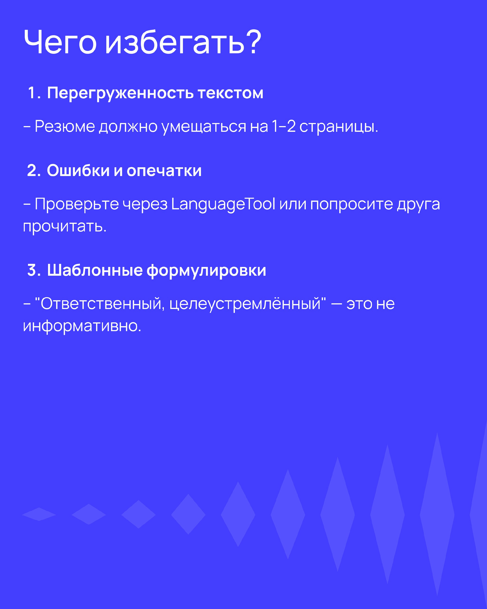

К проектам свое добавлять

- site:stackoverflow.com how to test react code — поиск среди страниц сайта Stackoverflow.
- add class to element -jquery — дефисом стоп-слова, найдены все варианты, в которых эти слова не упоминаются.
- "immutable js" — двойные кавычки искать точное совпадение.
- github js http client — найти библиотеку для выполнения HTTP-запросов в JavaScript.

- Держи конспекты в читаемом виде.
- Programmer - решать задачи бизнеса с помощью кода

- Понимай что за действия делаешь и зачем. Как эти конструкции решают реальные задачи.
- Обучение - поток, темы добавляются когда нужно и только, чтобы решить очередную задачу.
- Читай чужой код, код библиотек, которые используешь на GitHub.

- Критерии готовности для поиска работы: выполнить тестовые задания.
- Написать работающий проект с нуля (таск-менеджер, API-сервис), а не иметь множество отрывочных знаний.

отладчик, программу встроенную в редактор, выполнять код по шагам. Умение читать логи, пользоваться дебаггером

резюме инструмент продажи навыков. четким, ориентированным на пользу работодателя и подкреплённым примерами.

пробные собеседования – сайты, где потренироваться.

Алгоритмы и структуры данных
1. коллекциями
Практикуйтесь на реальных данных (обрабатывайте JSON-файлы).
методы массивов: map, filter, reduce, sort.
задачи без встроенных функций — как работают алгоритмы «под капотом».

1. оценивать сложность кода
Поиск элемента в неотсортированном массиве — O(n) (проверить все элементы).
Поиск в хэш-таблице — O(1) (мгновенно).
Разберитесь базово с Big O нотацией.
Сравнивайте разные решения одной задачи: какой код быстрее?
Если код тормозит — ищите «узкие места» (вложенные циклы).

1. Освойте базовые структуры данных
Деревья — файловые системы, DOM в браузере.
Графы — маршруты в картах, зависимости библиотек.
Очереди — обработка задач (сообщения в чате).
написать свою простую хэш-таблицу или бинарное дерево.
как работают стек и очередь (как браузер хранит историю).

сортировка, поиск.
Потом — рекурсия, динамическое программирование.
Затем — графы и деревья.

- Как работают HTTP-запросы, API и базы данных.
Основы безопасности (SQL-инъекции, XSS, работа с авторизацией).

- SQL и работу с API (базовые запросы, GET/POST-запросы)

Разбейте код на функции, понятные имена переменных – не скидывайте всё в один файл.
