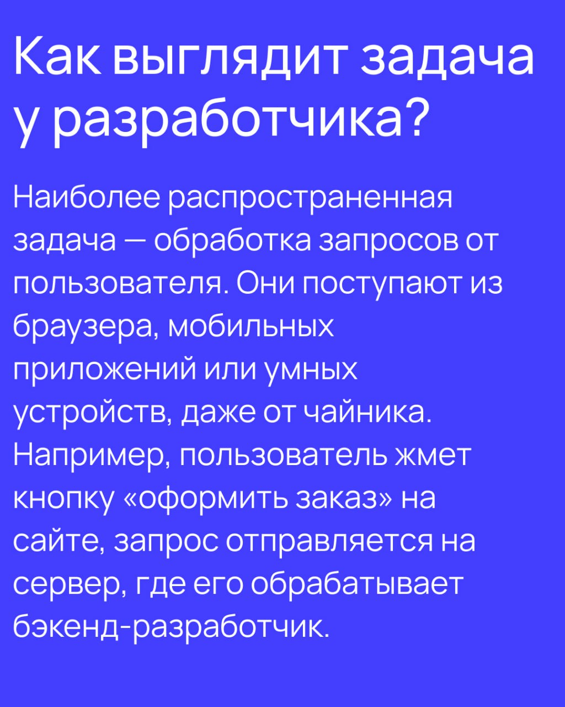

## Notes

К проектам свое добавлять
моню рефакнуть код(приводить структуру файловую)

конспекты к нормальному виду

1) English

- Читай оригинальные материалы. Формулировать мысли и искать информацию на английском.
- Английский позволяет внимательнее вчитываться.

- site:stackoverflow.com how to test react code — поиск среди страниц сайта Stackoverflow.
- add class to element -jquery — дефисом стоп-слова, найдены все варианты, в которых эти слова не упоминаются.
- "immutable js" — двойные кавычки искать точное совпадение.
- github js http client — найти библиотеку для выполнения HTTP-запросов в JavaScript.
- в сообщении параметры '1' и 0. очистить фразу, php Failed asserting that matches expected.

2) Conspects

- Конспектируй - не копируй, пиши своими словами на английском.
- Держи конспекты в читаемом виде.
- Не копи гору - появился материал, его изучил, пошёл дальше.

3) Programmer

- Способность понимать, решать задачи бизнеса с помощью кода, предлагать эффективные решения и воплощать их в жизнь.

4) Principles

- Гугли, читай доки, вместо использования chatgpt. Не знаешь как что то сделать - загугли.
- Понимай что за действия делаешь и зачем. Пиши сам, не копируй. Как эти конструкции решают реальные задачи.
- Привычку учиться регулярно — ключ к успеху в обучении, время на занятия каждый день.
- Понимай логику программирования, как работают алгоритмы и структуры данных, почему вещи работают именно так, а не иначе.
- При ошибке понять что произошло и почему.
- Обучение - поток, темы добавляются когда нужно и только, чтобы решить очередную задачу.
- Читай чужой код, код библиотек, которые используешь на GitHub.

5) Goal

- Критерии готовности для поиска работы: способность выполнить тестовые задания компании.
- Способность собрать работающий проект с нуля, а не иметь множество отрывочных знаний, вместе не складываются в общую систему. Написать законченное приложение, а не стать специалистами в каждой из областей.

отладчик, программу встроенную в редактор, выполнять код по шагам.

---

резюме инструмент продажи навыков. четким, ориентированным на пользу работодателя и подкреплённым примерами.

✔️ алгоритмы (поиск, сортировка)
✔️ SQL и работу с API (базовые запросы, GET/POST-запросы)

если не знаете ответ – рассуждайте вслух.

✔️ пробные собеседования – есть сайты, где можно потренироваться бесплатно.
✔️ Запишите на видео – где теряетесь, и избавитесь от слов-паразитов

Алгоритмы и структуры данных
1. коллекциями
Практикуйтесь на реальных данных (обрабатывайте JSON-файлы).
методы массивов: map, filter, reduce, sort.
задачи без встроенных функций — как работают алгоритмы «под капотом».

1. оценивать сложность кода
Поиск элемента в неотсортированном массиве — O(n) (проверить все элементы).
Поиск в хэш-таблице — O(1) (мгновенно).
Разберитесь с Big O нотацией (базово).
Сравнивайте разные решения одной задачи: какой код быстрее?
Если код тормозит — ищите «узкие места» (вложенные циклы).

1. Освойте базовые структуры данных
Деревья — файловые системы, DOM в браузере.
Графы — маршруты в картах, зависимости библиотек.
Очереди — обработка задач (сообщения в чате).
написать свою простую хэш-таблицу или бинарное дерево.
как работают стек и очередь (как браузер хранит историю).

Начните с простых задач (сортировка, поиск).
Потом — рекурсия, динамическое программирование.
Затем — графы и деревья.

✅ Разработать проект (таск-менеджер, API-сервис).

проекты реально работающими приложениями.

✅ Git (pull requests, ветки, merge, rebase).
контрибьютить в open-source

✅ Как работают HTTP-запросы, API и базы данных.
✅ Основы алгоритмов
✅ Основы безопасности (SQL-инъекции, XSS, работа с авторизацией).

✅ Гуглите по Stack Overflow, документации
✅Читаете официальные доки, а не просто копируете чужие решения.

ветки, пулл-реквесты

Умение читать логи, пользоваться дебаггером

Разбейте код на функции, используйте понятные имена переменных – не скидывайте всё в один файл.

Никто не хочет читать код, где отступы пляшут, а названия переменных выглядят как x1, x2, a, b. стандарты (Prettier, ESLint, PEP8).

алгоритмы, структуры данных, ООП, SQL, HTTP.

